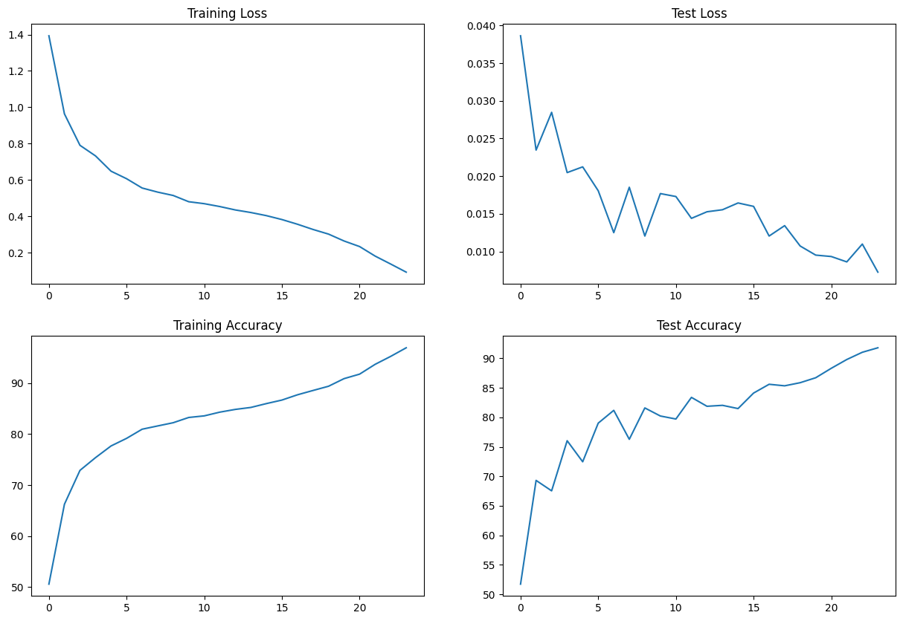
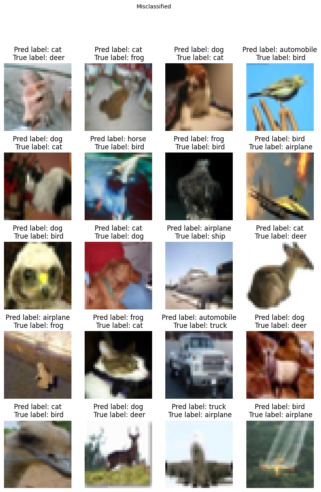
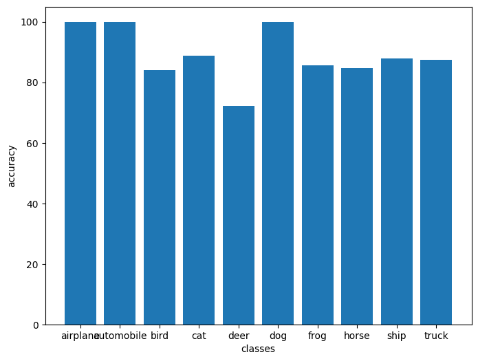

# Submission for Week 5
- [File Structure](#File-Structure)
- [Problem Statement](#Problem-Statement)
- [Model Parameters](#Model-Parameters)
- [Receptive Field and Output Shape Calculation of Layers](#Receptive-Field-and-Output-Shape-Calculation-of-Layers)
- [Results](#Results)
    * [Accuracy Plot](#Accuracy-Plot)
    * [Sample Output](#Sample-Output)
    * [Misclassified Images](#Misclassified-Images)
    * [Accuracy Report for Each class](#Accuracy-Report-for-Each-class )

# File Structure
* Beluga -> A Repository contains files for training 
    * model.py -> For importing model architecture
    * train.py -> Contains training loop 
    * test.py -> Contains code for running model on test set 
    * utils.py -> Contains supportive functions

* S10.ipynb -> Notebook Contains model training
* Experiments -> Contains other experiments before deviding the final model and accuracy  

# Problem Statement
### Training CNN for MNIST dataset
1. Train CNN on cifar dataset with residual blocks
2. Target accuracy -> 90% on test set 
3. Use torch_lr_finder for finding LR
4. User OneCycleLR as Lr scheduler


# LR Finding 

For finding the Optimal learning rate torch_lr_finder module is used

``````
from torch_lr_finder import LRFinder
model = CustomResnet().to(device)
optimizer = optim.Adam(model.parameters(), lr=0.01, weight_decay=1e-4)
criterion = torch.nn.CrossEntropyLoss()
lr_finder = LRFinder(model, optimizer, criterion, device="cuda")
lr_finder.range_test(train_loader, end_lr=10, num_iter=200, step_mode="exp")
lr_finder.plot() # to inspect the loss-learning rate graph
lr_finder.reset() # to reset the model and optimizer to their initial state
``````

LR suggestion: steepest gradient
Suggested LR: 2.47E-02

For gettting best out of it, model is trained on very high LR till 5th epoch and later till 24th epoch the LR was keep dropping 

# Model Parameters

``````
----------------------------------------------------------------
        Layer (type)               Output Shape         Param #
----------------------------------------------------------------
            Conv2d-1           [-1, 64, 32, 32]           1,728
       BatchNorm2d-2           [-1, 64, 32, 32]             128
              ReLU-3           [-1, 64, 32, 32]               0
            Conv2d-4          [-1, 128, 32, 32]          73,728
         MaxPool2d-5          [-1, 128, 16, 16]               0
       BatchNorm2d-6          [-1, 128, 16, 16]             256
              ReLU-7          [-1, 128, 16, 16]               0
            Conv2d-8          [-1, 128, 16, 16]         147,456
       BatchNorm2d-9          [-1, 128, 16, 16]             256
             ReLU-10          [-1, 128, 16, 16]               0
           Conv2d-11          [-1, 128, 16, 16]         147,456
      BatchNorm2d-12          [-1, 128, 16, 16]             256
             ReLU-13          [-1, 128, 16, 16]               0
           Conv2d-14          [-1, 256, 16, 16]         294,912
        MaxPool2d-15            [-1, 256, 8, 8]               0
      BatchNorm2d-16            [-1, 256, 8, 8]             512
             ReLU-17            [-1, 256, 8, 8]               0
           Conv2d-18            [-1, 512, 8, 8]       1,179,648
        MaxPool2d-19            [-1, 512, 4, 4]               0
      BatchNorm2d-20            [-1, 512, 4, 4]           1,024
             ReLU-21            [-1, 512, 4, 4]               0
           Conv2d-22            [-1, 512, 4, 4]       2,359,296
      BatchNorm2d-23            [-1, 512, 4, 4]           1,024
             ReLU-24            [-1, 512, 4, 4]               0
           Conv2d-25            [-1, 512, 4, 4]       2,359,296
      BatchNorm2d-26            [-1, 512, 4, 4]           1,024
             ReLU-27            [-1, 512, 4, 4]               0
        MaxPool2d-28            [-1, 512, 1, 1]               0
           Linear-29                   [-1, 10]           5,130
----------------------------------------------------------------
    Total params: 6,573,130
    Trainable params: 6,573,130
    Non-trainable params: 0
----------------------------------------------------------------
    Input size (MB): 0.01
    Forward/backward pass size (MB): 6.44
    Params size (MB): 25.07
    Estimated Total Size (MB): 31.53
----------------------------------------------------------------
``````

# Accuracy Report

|Model Experiments|Found LR|Best Validation accuracy| Best Training Accuray |
|--|--|--|--|
|experiments/S10.ipynb|2.47E-02|91.73%|96.89%|
|S10.ipynb|1.73E-02|91.97%|98.16%|


# Training Logs

```
Epoch 1
Train: Loss=0.9495 Batch_id=97 Accuracy=51.13: 100%|██████████| 98/98 [00:53<00:00,  1.82it/s]
Test set: Average loss: 0.0340, Accuracy: 5980/10000 (59.80%)

Epoch 2
Train: Loss=0.8421 Batch_id=97 Accuracy=67.68: 100%|██████████| 98/98 [00:53<00:00,  1.84it/s]
Test set: Average loss: 0.0289, Accuracy: 7077/10000 (70.77%)

Epoch 3
Train: Loss=0.7909 Batch_id=97 Accuracy=72.99: 100%|██████████| 98/98 [00:53<00:00,  1.85it/s]
Test set: Average loss: 0.0282, Accuracy: 7253/10000 (72.53%)

Epoch 4
Train: Loss=0.6936 Batch_id=97 Accuracy=76.22: 100%|██████████| 98/98 [00:52<00:00,  1.86it/s]
Test set: Average loss: 0.0280, Accuracy: 7105/10000 (71.05%)

Epoch 5
Train: Loss=0.6491 Batch_id=97 Accuracy=77.76: 100%|██████████| 98/98 [00:53<00:00,  1.84it/s]
Test set: Average loss: 0.0407, Accuracy: 5963/10000 (59.63%)

Epoch 6
Train: Loss=0.5590 Batch_id=97 Accuracy=80.85: 100%|██████████| 98/98 [00:52<00:00,  1.86it/s]
Test set: Average loss: 0.0196, Accuracy: 7761/10000 (77.61%)

Epoch 7
Train: Loss=0.4207 Batch_id=97 Accuracy=82.98: 100%|██████████| 98/98 [00:52<00:00,  1.86it/s]
Test set: Average loss: 0.0205, Accuracy: 7748/10000 (77.48%)

Epoch 8
Train: Loss=0.4243 Batch_id=97 Accuracy=84.13: 100%|██████████| 98/98 [00:52<00:00,  1.87it/s]
Test set: Average loss: 0.0192, Accuracy: 8062/10000 (80.62%)

Epoch 9
Train: Loss=0.4336 Batch_id=97 Accuracy=84.87: 100%|██████████| 98/98 [00:52<00:00,  1.87it/s]
Test set: Average loss: 0.0212, Accuracy: 7728/10000 (77.28%)

Epoch 10
Train: Loss=0.3729 Batch_id=97 Accuracy=85.51: 100%|██████████| 98/98 [00:53<00:00,  1.85it/s]
Test set: Average loss: 0.0217, Accuracy: 7766/10000 (77.66%)

Epoch 11
Train: Loss=0.4247 Batch_id=97 Accuracy=86.58: 100%|██████████| 98/98 [00:52<00:00,  1.85it/s]
Test set: Average loss: 0.0201, Accuracy: 7975/10000 (79.75%)

Epoch 12
Train: Loss=0.3482 Batch_id=97 Accuracy=87.06: 100%|██████████| 98/98 [00:52<00:00,  1.85it/s]
Test set: Average loss: 0.0123, Accuracy: 8398/10000 (83.98%)

Epoch 13
Train: Loss=0.4099 Batch_id=97 Accuracy=88.03: 100%|██████████| 98/98 [00:52<00:00,  1.87it/s]
Test set: Average loss: 0.0120, Accuracy: 8608/10000 (86.08%)

Epoch 14
Train: Loss=0.4361 Batch_id=97 Accuracy=88.12: 100%|██████████| 98/98 [00:52<00:00,  1.85it/s]
Test set: Average loss: 0.0131, Accuracy: 8423/10000 (84.23%)

Epoch 15
Train: Loss=0.3742 Batch_id=97 Accuracy=88.75: 100%|██████████| 98/98 [00:52<00:00,  1.86it/s]
Test set: Average loss: 0.0101, Accuracy: 8376/10000 (83.76%)

Epoch 16
Train: Loss=0.2820 Batch_id=97 Accuracy=89.74: 100%|██████████| 98/98 [00:52<00:00,  1.87it/s]
Test set: Average loss: 0.0091, Accuracy: 8559/10000 (85.59%)

Epoch 17
Train: Loss=0.2570 Batch_id=97 Accuracy=90.55: 100%|██████████| 98/98 [00:52<00:00,  1.87it/s]
Test set: Average loss: 0.0116, Accuracy: 8679/10000 (86.79%)

Epoch 18
Train: Loss=0.2695 Batch_id=97 Accuracy=91.38: 100%|██████████| 98/98 [00:52<00:00,  1.85it/s]
Test set: Average loss: 0.0079, Accuracy: 8656/10000 (86.56%)

Epoch 19
Train: Loss=0.3383 Batch_id=97 Accuracy=92.23: 100%|██████████| 98/98 [00:52<00:00,  1.88it/s]
Test set: Average loss: 0.0097, Accuracy: 8734/10000 (87.34%)

Epoch 20
Train: Loss=0.1746 Batch_id=97 Accuracy=93.03: 100%|██████████| 98/98 [00:52<00:00,  1.86it/s]
Test set: Average loss: 0.0093, Accuracy: 8796/10000 (87.96%)

Epoch 21
Train: Loss=0.2099 Batch_id=97 Accuracy=94.61: 100%|██████████| 98/98 [00:51<00:00,  1.89it/s]
Test set: Average loss: 0.0078, Accuracy: 9029/10000 (90.29%)

Epoch 22
Train: Loss=0.1276 Batch_id=97 Accuracy=95.85: 100%|██████████| 98/98 [00:52<00:00,  1.86it/s]
Test set: Average loss: 0.0069, Accuracy: 9097/10000 (90.97%)

Epoch 23
Train: Loss=0.0465 Batch_id=97 Accuracy=97.16: 100%|██████████| 98/98 [00:52<00:00,  1.86it/s]
Test set: Average loss: 0.0096, Accuracy: 9161/10000 (91.61%)

Epoch 24
Train: Loss=0.0458 Batch_id=97 Accuracy=98.16: 100%|██████████| 98/98 [00:52<00:00,  1.88it/s]
Test set: Average loss: 0.0052, Accuracy: 9197/10000 (91.97%)

```

# Results

## Accuracy Plot
Here is the Accuracy and Loss metric plot for the model 

<p align="center">
    
</p>


## Misclassified Images
Here is the sample result of model miss-classified images

<p align="center">
    
</p>

## Accuracy Report for Each class   

    Accuracy of airplane : 100 %

    Accuracy of automobile : 100 %

    Accuracy of  bird : 84 %

    Accuracy of   cat : 88 %

    Accuracy of  deer : 72 %

    Accuracy of   dog : 100 %

    Accuracy of  frog : 85 %

    Accuracy of horse : 84 %

    Accuracy of  ship : 88 %

    Accuracy of truck : 87 %
        
<p align="center">
    
</p>