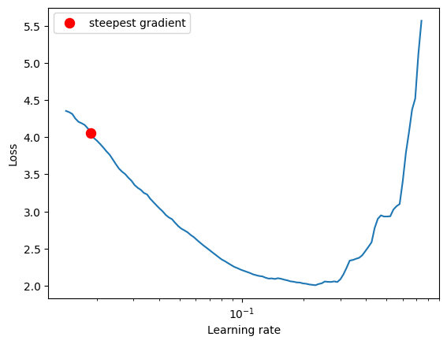
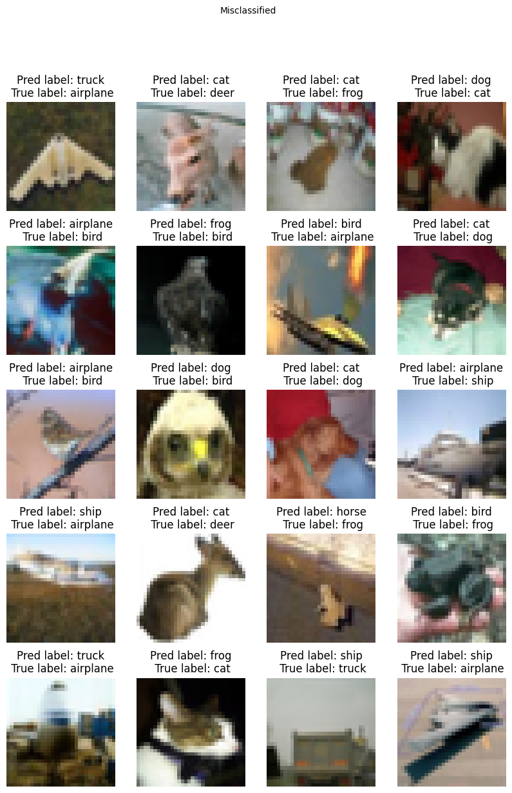
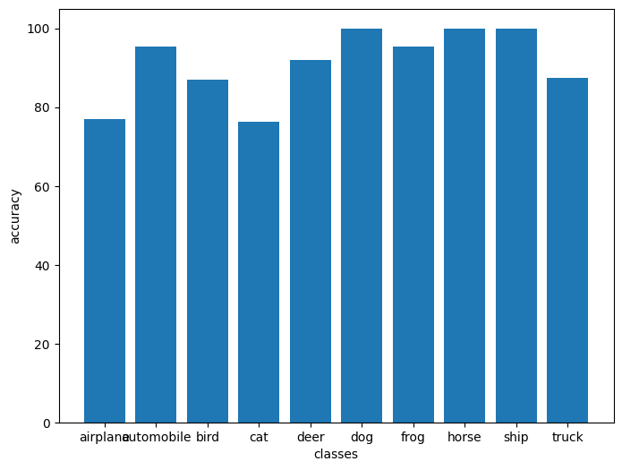

# Submission for Session 10
- [File Structure](#File-Structure)
- [Problem Statement](#Problem-Statement)
- [LR Finding](#LR-Finding)
- [Model Parameters](#Model-Parameters)
- [Accuracy Report](#Accuracy-Report)
- [Training Logs](#Training-Logs)
- [Results](#Results)
    * [Accuracy Plot](#Accuracy-Plot)
    * [Misclassified Images](#Misclassified-Images)
    * [Accuracy Report for Each class](#Accuracy-Report-for-Each-class )

# File Structure
* [custom_models](https://github.com/deepanshudashora/custom_models) -> A Repository contains files for training 
    * [custom_resnet.py](https://github.com/deepanshudashora/custom_models/blob/main/custom_resnet.py) -> For importing model architecture
    * [train.py](https://github.com/deepanshudashora/custom_models/blob/main/train.py) -> Contains training loop 
    * [test.py](https://github.com/deepanshudashora/custom_models/blob/main/test.py) -> Contains code for running model on the test set 
    * [utils.py](https://github.com/deepanshudashora/custom_models/blob/main/utils.py) -> Contains supportive functions

* [S10.ipynb](https://github.com/deepanshudashora/ERAV1/blob/master/session10/S10.ipynb) -> Notebook Contains model training
* [Experiments](https://github.com/deepanshudashora/ERAV1/tree/master/session10/experiments) -> Contains other experiments before dividing the final model and accuracy  

# Problem Statement
1. Train CNN on cifar dataset with residual blocks
2. Target accuracy -> 90% on the test set 
3. Use torch_lr_finder for finding LR
4. User OneCycleLR as Lr scheduler


# LR Finding 

For finding the Optimal learning rate [torch_lr_finder](https://github.com/davidtvs/pytorch-lr-finder) module is used

```
from torch_lr_finder import LRFinder
model = CustomResnet().to(device)
optimizer = optim.Adam(model.parameters(), lr=0.01, weight_decay=1e-4)
criterion = torch.nn.CrossEntropyLoss()
lr_finder = LRFinder(model, optimizer, criterion, device="cuda")
lr_finder.range_test(train_loader, end_lr=10, num_iter=200, step_mode="exp")
lr_finder.plot() # to inspect the loss-learning rate graph
lr_finder.reset() # to reset the model and optimizer to their initial state
```

<p align="center">
    
</p>


LR suggestion: steepest gradient
Suggested LR: 2.47E-02

For gettting best out of it, model is trained on very high LR till 5th epoch and later till 24th epoch the LR was keep dropping 

# Model Parameters

``````
==========================================================================================
Layer (type:depth-idx)                   Output Shape              Param #
==========================================================================================
CustomResnet                             [512, 10]                 --
├─Sequential: 1-1                        [512, 64, 32, 32]         --
│    └─Conv2d: 2-1                       [512, 64, 32, 32]         1,728
│    └─BatchNorm2d: 2-2                  [512, 64, 32, 32]         128
│    └─ReLU: 2-3                         [512, 64, 32, 32]         --
├─Sequential: 1-2                        [512, 128, 16, 16]        --
│    └─Conv2d: 2-4                       [512, 128, 32, 32]        73,728
│    └─MaxPool2d: 2-5                    [512, 128, 16, 16]        --
│    └─BatchNorm2d: 2-6                  [512, 128, 16, 16]        256
│    └─ReLU: 2-7                         [512, 128, 16, 16]        --
├─Sequential: 1-3                        [512, 128, 16, 16]        --
│    └─Conv2d: 2-8                       [512, 128, 16, 16]        147,456
│    └─BatchNorm2d: 2-9                  [512, 128, 16, 16]        256
│    └─ReLU: 2-10                        [512, 128, 16, 16]        --
│    └─Conv2d: 2-11                      [512, 128, 16, 16]        147,456
│    └─BatchNorm2d: 2-12                 [512, 128, 16, 16]        256
│    └─ReLU: 2-13                        [512, 128, 16, 16]        --
├─Sequential: 1-4                        [512, 256, 8, 8]          --
│    └─Conv2d: 2-14                      [512, 256, 16, 16]        294,912
│    └─MaxPool2d: 2-15                   [512, 256, 8, 8]          --
│    └─BatchNorm2d: 2-16                 [512, 256, 8, 8]          512
│    └─ReLU: 2-17                        [512, 256, 8, 8]          --
├─Sequential: 1-5                        [512, 512, 4, 4]          --
│    └─Conv2d: 2-18                      [512, 512, 8, 8]          1,179,648
│    └─MaxPool2d: 2-19                   [512, 512, 4, 4]          --
│    └─BatchNorm2d: 2-20                 [512, 512, 4, 4]          1,024
│    └─ReLU: 2-21                        [512, 512, 4, 4]          --
├─Sequential: 1-6                        [512, 512, 4, 4]          --
│    └─Conv2d: 2-22                      [512, 512, 4, 4]          2,359,296
│    └─BatchNorm2d: 2-23                 [512, 512, 4, 4]          1,024
│    └─ReLU: 2-24                        [512, 512, 4, 4]          --
│    └─Conv2d: 2-25                      [512, 512, 4, 4]          2,359,296
│    └─BatchNorm2d: 2-26                 [512, 512, 4, 4]          1,024
│    └─ReLU: 2-27                        [512, 512, 4, 4]          --
├─MaxPool2d: 1-7                         [512, 512, 1, 1]          --
├─Linear: 1-8                            [512, 10]                 5,130
==========================================================================================
Total params: 6,573,130
Trainable params: 6,573,130
Non-trainable params: 0
Total mult-adds (G): 194.18
==========================================================================================
Input size (MB): 6.29
Forward/backward pass size (MB): 2382.41
Params size (MB): 26.29
Estimated Total Size (MB): 2414.99
==========================================================================================
``````

# Accuracy Report

|Model Experiments|Found Max LR|Min LR|Best Validation accuracy| Best Training Accuray |
|--|--|--|--|--|
|[Exp-1](https://github.com/deepanshudashora/ERAV1/blob/master/session10/experiments/S10_95_90.ipynb)|3.31E-02|0.023|90.91%|95.88%|
|[Exp-2](https://github.com/deepanshudashora/ERAV1/blob/master/session10/experiments/S10_96_91.ipynb)|2.63E-02|0.02|91.32%|96.95%|
|[Exp-3](https://github.com/deepanshudashora/ERAV1/blob/master/session10/experiments/S10_98_91.ipynb)|1.19E-02|0.01|91.72%|98.77%|
|[S10.ipynb](https://github.com/deepanshudashora/ERAV1/blob/master/session10/S10.ipynb)|1.87E-02|0.01|91.80%|96.93%|


# Training Logs

```
Epoch 1
Train: Loss=0.9490 Batch_id=97 Accuracy=50.59: 100%|██████████| 98/98 [00:53<00:00,  1.85it/s]
Test set: Average loss: 0.0386, Accuracy: 5172/10000 (51.72%)

Epoch 2
Train: Loss=0.7590 Batch_id=97 Accuracy=66.25: 100%|██████████| 98/98 [00:53<00:00,  1.85it/s]
Test set: Average loss: 0.0235, Accuracy: 6931/10000 (69.31%)

Epoch 3
Train: Loss=0.9701 Batch_id=97 Accuracy=72.90: 100%|██████████| 98/98 [00:53<00:00,  1.83it/s]
Test set: Average loss: 0.0285, Accuracy: 6754/10000 (67.54%)

Epoch 4
Train: Loss=0.7411 Batch_id=97 Accuracy=75.39: 100%|██████████| 98/98 [00:53<00:00,  1.82it/s]
Test set: Average loss: 0.0205, Accuracy: 7604/10000 (76.04%)

Epoch 5
Train: Loss=0.6207 Batch_id=97 Accuracy=77.68: 100%|██████████| 98/98 [00:53<00:00,  1.82it/s]
Test set: Average loss: 0.0212, Accuracy: 7247/10000 (72.47%)

Epoch 6
Train: Loss=0.5695 Batch_id=97 Accuracy=79.17: 100%|██████████| 98/98 [00:53<00:00,  1.82it/s]
Test set: Average loss: 0.0181, Accuracy: 7902/10000 (79.02%)

Epoch 7
Train: Loss=0.6019 Batch_id=97 Accuracy=80.96: 100%|██████████| 98/98 [00:53<00:00,  1.82it/s]
Test set: Average loss: 0.0125, Accuracy: 8119/10000 (81.19%)

Epoch 8
Train: Loss=0.5925 Batch_id=97 Accuracy=81.60: 100%|██████████| 98/98 [00:53<00:00,  1.84it/s]
Test set: Average loss: 0.0185, Accuracy: 7628/10000 (76.28%)

Epoch 9
Train: Loss=0.5473 Batch_id=97 Accuracy=82.24: 100%|██████████| 98/98 [00:53<00:00,  1.83it/s]
Test set: Average loss: 0.0121, Accuracy: 8160/10000 (81.60%)

Epoch 10
Train: Loss=0.4864 Batch_id=97 Accuracy=83.27: 100%|██████████| 98/98 [00:53<00:00,  1.83it/s]
Test set: Average loss: 0.0177, Accuracy: 8023/10000 (80.23%)

Epoch 11
Train: Loss=0.4858 Batch_id=97 Accuracy=83.58: 100%|██████████| 98/98 [00:53<00:00,  1.84it/s]
Test set: Average loss: 0.0173, Accuracy: 7972/10000 (79.72%)

Epoch 12
Train: Loss=0.6261 Batch_id=97 Accuracy=84.31: 100%|██████████| 98/98 [00:54<00:00,  1.81it/s]
Test set: Average loss: 0.0144, Accuracy: 8339/10000 (83.39%)

Epoch 13
Train: Loss=0.4370 Batch_id=97 Accuracy=84.85: 100%|██████████| 98/98 [00:53<00:00,  1.83it/s]
Test set: Average loss: 0.0153, Accuracy: 8188/10000 (81.88%)

Epoch 14
Train: Loss=0.4110 Batch_id=97 Accuracy=85.23: 100%|██████████| 98/98 [00:53<00:00,  1.83it/s]
Test set: Average loss: 0.0155, Accuracy: 8204/10000 (82.04%)

Epoch 15
Train: Loss=0.3817 Batch_id=97 Accuracy=85.99: 100%|██████████| 98/98 [00:53<00:00,  1.84it/s]
Test set: Average loss: 0.0164, Accuracy: 8149/10000 (81.49%)

Epoch 16
Train: Loss=0.4587 Batch_id=97 Accuracy=86.68: 100%|██████████| 98/98 [00:53<00:00,  1.84it/s]
Test set: Average loss: 0.0160, Accuracy: 8412/10000 (84.12%)

Epoch 17
Train: Loss=0.3425 Batch_id=97 Accuracy=87.71: 100%|██████████| 98/98 [00:53<00:00,  1.83it/s]
Test set: Average loss: 0.0121, Accuracy: 8561/10000 (85.61%)

Epoch 18
Train: Loss=0.3654 Batch_id=97 Accuracy=88.56: 100%|██████████| 98/98 [00:53<00:00,  1.82it/s]
Test set: Average loss: 0.0134, Accuracy: 8535/10000 (85.35%)

Epoch 19
Train: Loss=0.3320 Batch_id=97 Accuracy=89.39: 100%|██████████| 98/98 [00:54<00:00,  1.81it/s]
Test set: Average loss: 0.0107, Accuracy: 8588/10000 (85.88%)

Epoch 20
Train: Loss=0.1886 Batch_id=97 Accuracy=90.88: 100%|██████████| 98/98 [00:53<00:00,  1.83it/s]
Test set: Average loss: 0.0095, Accuracy: 8672/10000 (86.72%)

Epoch 21
Train: Loss=0.2095 Batch_id=97 Accuracy=91.76: 100%|██████████| 98/98 [00:53<00:00,  1.82it/s]
Test set: Average loss: 0.0093, Accuracy: 8832/10000 (88.32%)

Epoch 22
Train: Loss=0.1929 Batch_id=97 Accuracy=93.69: 100%|██████████| 98/98 [00:53<00:00,  1.83it/s]
Test set: Average loss: 0.0086, Accuracy: 8981/10000 (89.81%)

Epoch 23
Train: Loss=0.1346 Batch_id=97 Accuracy=95.24: 100%|██████████| 98/98 [00:53<00:00,  1.83it/s]
Test set: Average loss: 0.0110, Accuracy: 9104/10000 (91.04%)

Epoch 24
Train: Loss=0.0887 Batch_id=97 Accuracy=96.93: 100%|██████████| 98/98 [00:53<00:00,  1.83it/s]
Test set: Average loss: 0.0073, Accuracy: 9180/10000 (91.80%)

```

# Results

## Accuracy Plot
Here is the Accuracy and Loss metric plot for the model 

<p align="center">
    
</p>


## Misclassified Images
Here is the sample result of model miss-classified images

<p align="center">
    
</p>

## Accuracy Report for Each class   

    Accuracy of airplane : 76 %

    Accuracy of automobile : 95 %

    Accuracy of  bird : 86 %

    Accuracy of   cat : 76 %

    Accuracy of  deer : 92 %

    Accuracy of   dog : 100 %

    Accuracy of  frog : 95 %

    Accuracy of horse : 100 %

    Accuracy of  ship : 100 %

    Accuracy of truck : 87 %
        
<p align="center">
    
</p>
