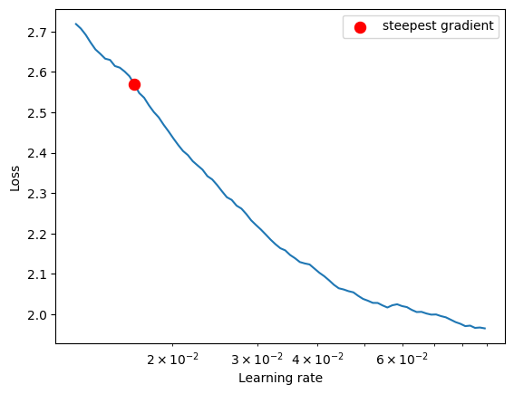
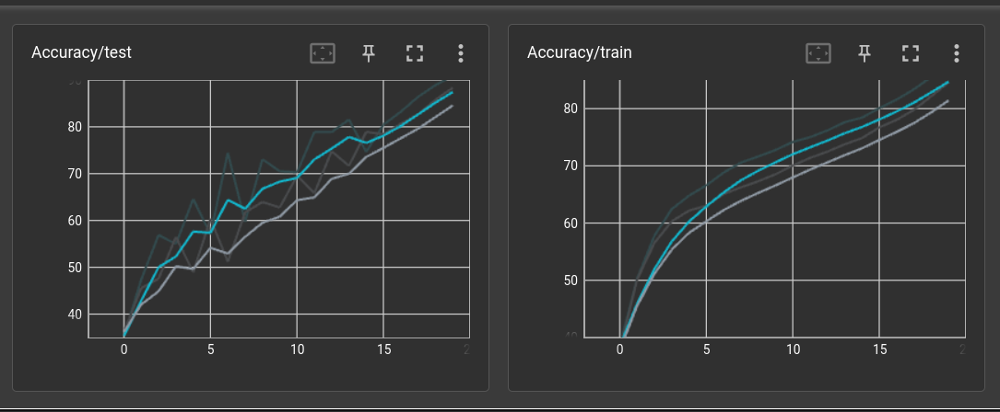
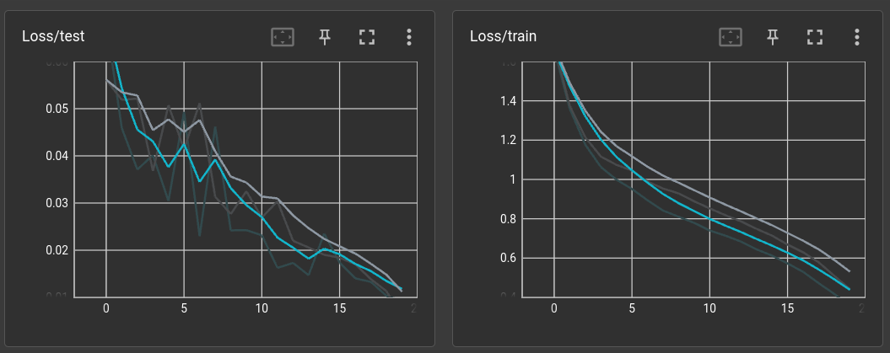
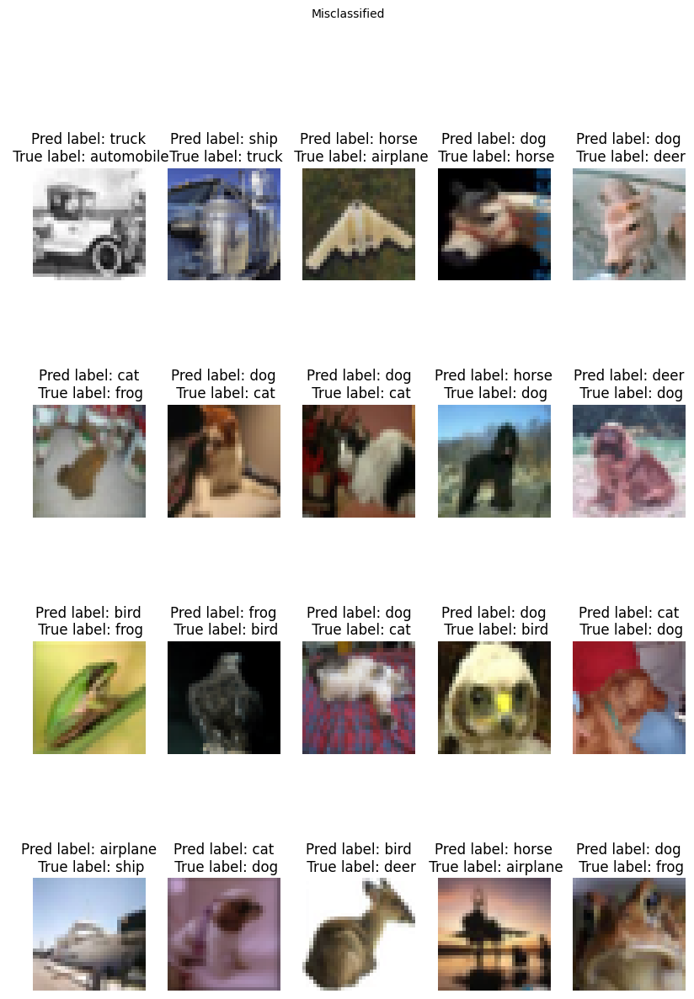
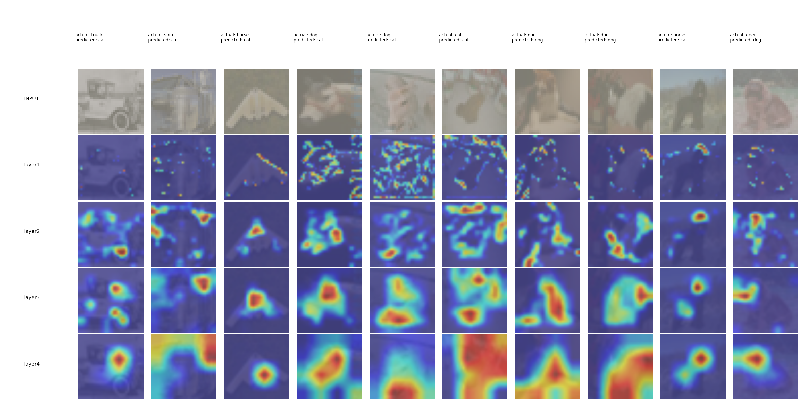
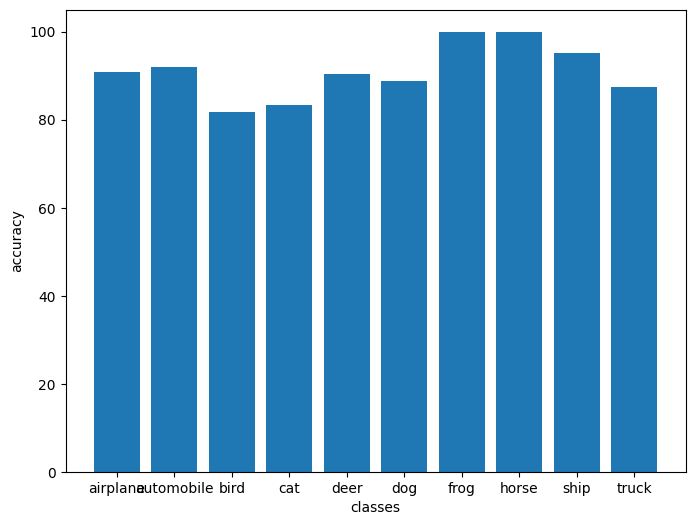

# Submission for Session 10

- [File Structure](#File-Structure)
- [Problem Statement](#Problem-Statement)
- [LR Finding](#LR-Finding)
- [Model Parameters](#Model-Parameters)
- [Accuracy Report](#Accuracy-Report)
- [Training Logs](#Training-Logs)
- [Results](#Results)
  * [Accuracy Plot](#Accuracy-Plot)
  * [Misclassified Images](#Misclassified-Images)
  * [Accuracy Report for Each class](#Accuracy-Report-for-Each-class)

# File Structure

* [custom_models](https://github.com/deepanshudashora/custom_models) -> A Repository contains files for training

  * [models](https://github.com/deepanshudashora/custom_models/tree/main/models) -> For importing model architecture, for this particular problem statement we will be importing resnet.py file and using resnet18 model
  * [train.py](https://github.com/deepanshudashora/custom_models/blob/main/train.py) -> Contains training loop
  * [test.py](https://github.com/deepanshudashora/custom_models/blob/main/test.py) -> Contains code for running model on the test set
  * [utils.py](https://github.com/deepanshudashora/custom_models/blob/main/utils.py) -> Contains supportive functions
  * [main.py](https://github.com/deepanshudashora/custom_models/blob/main/main.py) -> Contains code for fitting model in training and testing loops
  * [gradcam_utils.py](https://github.com/deepanshudashora/custom_models/blob/main/gradcam_utils.py) -> Contains code for running gradcam on model after training
* [S11.ipynb](https://github.com/deepanshudashora/ERAV1/blob/master/session10/S10.ipynb) -> Notebook Contains model training

# Problem Statement

1. Train Resnet18 on cifar dataset
2. Use torch_lr_finder for finding LR
3. Use Gradcam

# LR Finding

For finding the Optimal learning rate [torch_lr_finder](https://github.com/davidtvs/pytorch-lr-finder) module is used

```
from torch_lr_finder import LRFinder
model = CustomResnet().to(device)
optimizer = optim.Adam(model.parameters(), lr=0.01, weight_decay=1e-4)
criterion = torch.nn.CrossEntropyLoss()
lr_finder = LRFinder(model, optimizer, criterion, device="cuda")
lr_finder.range_test(train_loader, end_lr=0.1, num_iter=200, step_mode="exp")
lr_finder.plot() # to inspect the loss-learning rate graph
lr_finder.reset() # to reset the model and optimizer to their initial state
```

<p align="center">
    
</p>

LR suggestion: steepest gradient
Suggested LR: 5.16E-02

For gettting best out of it, model is trained on very high LR till 5th epoch and later till 24th epoch the LR was keep dropping

# Model Parameters

``````
==========================================================================================
Layer (type:depth-idx)                   Output Shape              Param #
==========================================================================================
ResNet                                   [512, 10]                 --
├─Conv2d: 1-1                            [512, 64, 32, 32]         1,728
├─BatchNorm2d: 1-2                       [512, 64, 32, 32]         128
├─Sequential: 1-3                        [512, 64, 32, 32]         --
│    └─BasicBlock: 2-1                   [512, 64, 32, 32]         --
│    │    └─Conv2d: 3-1                  [512, 64, 32, 32]         36,864
│    │    └─BatchNorm2d: 3-2             [512, 64, 32, 32]         128
│    │    └─Conv2d: 3-3                  [512, 64, 32, 32]         36,864
│    │    └─BatchNorm2d: 3-4             [512, 64, 32, 32]         128
│    │    └─Sequential: 3-5              [512, 64, 32, 32]         --
│    └─BasicBlock: 2-2                   [512, 64, 32, 32]         --
│    │    └─Conv2d: 3-6                  [512, 64, 32, 32]         36,864
│    │    └─BatchNorm2d: 3-7             [512, 64, 32, 32]         128
│    │    └─Conv2d: 3-8                  [512, 64, 32, 32]         36,864
│    │    └─BatchNorm2d: 3-9             [512, 64, 32, 32]         128
│    │    └─Sequential: 3-10             [512, 64, 32, 32]         --
├─Sequential: 1-4                        [512, 128, 16, 16]        --
│    └─BasicBlock: 2-3                   [512, 128, 16, 16]        --
│    │    └─Conv2d: 3-11                 [512, 128, 16, 16]        73,728
│    │    └─BatchNorm2d: 3-12            [512, 128, 16, 16]        256
│    │    └─Conv2d: 3-13                 [512, 128, 16, 16]        147,456
│    │    └─BatchNorm2d: 3-14            [512, 128, 16, 16]        256
│    │    └─Sequential: 3-15             [512, 128, 16, 16]        --
│    │    │    └─Conv2d: 4-1             [512, 128, 16, 16]        8,192
│    │    │    └─BatchNorm2d: 4-2        [512, 128, 16, 16]        256
│    └─BasicBlock: 2-4                   [512, 128, 16, 16]        --
│    │    └─Conv2d: 3-16                 [512, 128, 16, 16]        147,456
│    │    └─BatchNorm2d: 3-17            [512, 128, 16, 16]        256
│    │    └─Conv2d: 3-18                 [512, 128, 16, 16]        147,456
│    │    └─BatchNorm2d: 3-19            [512, 128, 16, 16]        256
│    │    └─Sequential: 3-20             [512, 128, 16, 16]        --
├─Sequential: 1-5                        [512, 256, 8, 8]          --
│    └─BasicBlock: 2-5                   [512, 256, 8, 8]          --
│    │    └─Conv2d: 3-21                 [512, 256, 8, 8]          294,912
│    │    └─BatchNorm2d: 3-22            [512, 256, 8, 8]          512
│    │    └─Conv2d: 3-23                 [512, 256, 8, 8]          589,824
│    │    └─BatchNorm2d: 3-24            [512, 256, 8, 8]          512
│    │    └─Sequential: 3-25             [512, 256, 8, 8]          --
│    │    │    └─Conv2d: 4-3             [512, 256, 8, 8]          32,768
│    │    │    └─BatchNorm2d: 4-4        [512, 256, 8, 8]          512
│    └─BasicBlock: 2-6                   [512, 256, 8, 8]          --
│    │    └─Conv2d: 3-26                 [512, 256, 8, 8]          589,824
│    │    └─BatchNorm2d: 3-27            [512, 256, 8, 8]          512
│    │    └─Conv2d: 3-28                 [512, 256, 8, 8]          589,824
│    │    └─BatchNorm2d: 3-29            [512, 256, 8, 8]          512
│    │    └─Sequential: 3-30             [512, 256, 8, 8]          --
├─Sequential: 1-6                        [512, 512, 4, 4]          --
│    └─BasicBlock: 2-7                   [512, 512, 4, 4]          --
│    │    └─Conv2d: 3-31                 [512, 512, 4, 4]          1,179,648
│    │    └─BatchNorm2d: 3-32            [512, 512, 4, 4]          1,024
│    │    └─Conv2d: 3-33                 [512, 512, 4, 4]          2,359,296
│    │    └─BatchNorm2d: 3-34            [512, 512, 4, 4]          1,024
│    │    └─Sequential: 3-35             [512, 512, 4, 4]          --
│    │    │    └─Conv2d: 4-5             [512, 512, 4, 4]          131,072
│    │    │    └─BatchNorm2d: 4-6        [512, 512, 4, 4]          1,024
│    └─BasicBlock: 2-8                   [512, 512, 4, 4]          --
│    │    └─Conv2d: 3-36                 [512, 512, 4, 4]          2,359,296
│    │    └─BatchNorm2d: 3-37            [512, 512, 4, 4]          1,024
│    │    └─Conv2d: 3-38                 [512, 512, 4, 4]          2,359,296
│    │    └─BatchNorm2d: 3-39            [512, 512, 4, 4]          1,024
│    │    └─Sequential: 3-40             [512, 512, 4, 4]          --
├─Linear: 1-7                            [512, 10]                 5,130
==========================================================================================
Total params: 11,173,962
Trainable params: 11,173,962
Non-trainable params: 0
Total mult-adds (G): 284.38
==========================================================================================
Input size (MB): 6.29
Forward/backward pass size (MB): 5033.21
Params size (MB): 44.70
Estimated Total Size (MB): 5084.19
==========================================================================================
``````

# Accuracy Report

| Model Experiments                                                                                 | Found Max LR | Min LR | Best Validation accuracy | Best Training Accuray |
| ------------------------------------------------------------------------------------------------- | ------------ | ------ | ------------------------ | --------------------- |
| [Exp-1](https://github.com/deepanshudashora/ERAV1/blob/master/session10/experiments/S10_95_90.ipynb) | 5.16E-02     | 0.02   | 80.87%                   | 75.25%                |
| [Exp-2](https://github.com/deepanshudashora/ERAV1/blob/master/session10/experiments/S10_95_90.ipynb) | 3.74E-02     | 0.01   | 86.60%                   | 81.87%                |
| [Exp-3](https://github.com/deepanshudashora/ERAV1/blob/master/session10/experiments/S10_95_90.ipynb) | 2.91E-02     | 0.01   | 88.35%                   | 84.56%     
| [Exp-4](https://github.com/deepanshudashora/ERAV1/blob/master/session10/experiments/S10_95_90.ipynb) | 1.67E-02     | 0.01   | 90.83%                   | 87.50%                |

# Training Logs

```
Epoch 1
Train: Loss=1.5068 Batch_id=97 Accuracy=38.54: 100%|██████████| 98/98 [00:50<00:00,  1.94it/s]
Test set: Average loss: 0.0684, Accuracy: 3535/10000 (35.35%)

Epoch 2
Train: Loss=1.1956 Batch_id=97 Accuracy=50.34: 100%|██████████| 98/98 [00:49<00:00,  1.96it/s]
Test set: Average loss: 0.0459, Accuracy: 4744/10000 (47.44%)

Epoch 3
Train: Loss=1.0952 Batch_id=97 Accuracy=57.79: 100%|██████████| 98/98 [00:50<00:00,  1.95it/s]
Test set: Average loss: 0.0371, Accuracy: 5689/10000 (56.89%)

Epoch 4
Train: Loss=0.9364 Batch_id=97 Accuracy=62.44: 100%|██████████| 98/98 [00:49<00:00,  1.96it/s]
Test set: Average loss: 0.0401, Accuracy: 5495/10000 (54.95%)

Epoch 5
Train: Loss=1.0610 Batch_id=97 Accuracy=64.80: 100%|██████████| 98/98 [00:50<00:00,  1.96it/s]
Test set: Average loss: 0.0304, Accuracy: 6458/10000 (64.58%)

Epoch 6
Train: Loss=0.9985 Batch_id=97 Accuracy=66.59: 100%|██████████| 98/98 [00:49<00:00,  1.96it/s]
Test set: Average loss: 0.0493, Accuracy: 5702/10000 (57.02%)

Epoch 7
Train: Loss=0.8300 Batch_id=97 Accuracy=68.82: 100%|██████████| 98/98 [00:49<00:00,  1.97it/s]
Test set: Average loss: 0.0230, Accuracy: 7446/10000 (74.46%)

Epoch 8
Train: Loss=0.8276 Batch_id=97 Accuracy=70.57: 100%|██████████| 98/98 [00:49<00:00,  1.97it/s]
Test set: Average loss: 0.0462, Accuracy: 5971/10000 (59.71%)

Epoch 9
Train: Loss=0.7904 Batch_id=97 Accuracy=71.64: 100%|██████████| 98/98 [00:49<00:00,  1.97it/s]
Test set: Average loss: 0.0242, Accuracy: 7308/10000 (73.08%)

Epoch 10
Train: Loss=0.7128 Batch_id=97 Accuracy=72.77: 100%|██████████| 98/98 [00:49<00:00,  1.97it/s]
Test set: Average loss: 0.0243, Accuracy: 7052/10000 (70.52%)

Epoch 11
Train: Loss=0.8146 Batch_id=97 Accuracy=74.18: 100%|██████████| 98/98 [00:49<00:00,  1.96it/s]
Test set: Average loss: 0.0231, Accuracy: 7027/10000 (70.27%)

Epoch 12
Train: Loss=0.7267 Batch_id=97 Accuracy=75.02: 100%|██████████| 98/98 [00:49<00:00,  1.97it/s]
Test set: Average loss: 0.0163, Accuracy: 7891/10000 (78.91%)

Epoch 13
Train: Loss=0.6792 Batch_id=97 Accuracy=76.19: 100%|██████████| 98/98 [00:49<00:00,  1.97it/s]
Test set: Average loss: 0.0173, Accuracy: 7886/10000 (78.86%)

Epoch 14
Train: Loss=0.6163 Batch_id=97 Accuracy=77.63: 100%|██████████| 98/98 [00:49<00:00,  1.96it/s]
Test set: Average loss: 0.0147, Accuracy: 8155/10000 (81.55%)

Epoch 15
Train: Loss=0.6657 Batch_id=97 Accuracy=78.42: 100%|██████████| 98/98 [00:49<00:00,  1.97it/s]
Test set: Average loss: 0.0235, Accuracy: 7464/10000 (74.64%)

Epoch 16
Train: Loss=0.5449 Batch_id=97 Accuracy=80.09: 100%|██████████| 98/98 [00:49<00:00,  1.96it/s]
Test set: Average loss: 0.0173, Accuracy: 8047/10000 (80.47%)

Epoch 17
Train: Loss=0.5874 Batch_id=97 Accuracy=81.58: 100%|██████████| 98/98 [00:49<00:00,  1.98it/s]
Test set: Average loss: 0.0140, Accuracy: 8322/10000 (83.22%)

Epoch 18
Train: Loss=0.4334 Batch_id=97 Accuracy=83.37: 100%|██████████| 98/98 [00:49<00:00,  1.98it/s]
Test set: Average loss: 0.0133, Accuracy: 8642/10000 (86.42%)

Epoch 19
Train: Loss=0.5591 Batch_id=97 Accuracy=85.55: 100%|██████████| 98/98 [00:49<00:00,  1.98it/s]
Test set: Average loss: 0.0103, Accuracy: 8891/10000 (88.91%)

Epoch 20
Train: Loss=0.3874 Batch_id=97 Accuracy=87.50: 100%|██████████| 98/98 [00:49<00:00,  1.99it/s]
Test set: Average loss: 0.0093, Accuracy: 9083/10000 (90.83%)


```

# Results

## Accuracy Plot from Tensorboard

Here is the Accuracy and Loss metric plot for the model

<p align="center">
    
</p>

<p align="center">
    
</p>


## Misclassified Images

Here is the sample result of model miss-classified images

<p align="center">
    
</p>

## Gradcam Analysis

Here is the sample result of model miss-classified images

<p align="center">
    
</p>

## Accuracy Report for Each class

    Accuracy of airplane : 90 %

    Accuracy of automobile : 92 %

    Accuracy of  bird : 81 %

    Accuracy of   cat : 83 %

    Accuracy of  deer : 90 %

    Accuracy of   dog : 88 %

    Accuracy of  frog : 100 %

    Accuracy of horse : 100 %

    Accuracy of  ship : 95 %

    Accuracy of truck : 87 %

<p align="center">
    
</p>
