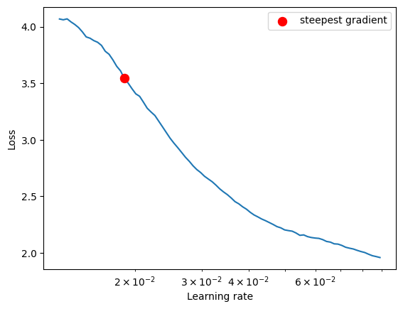
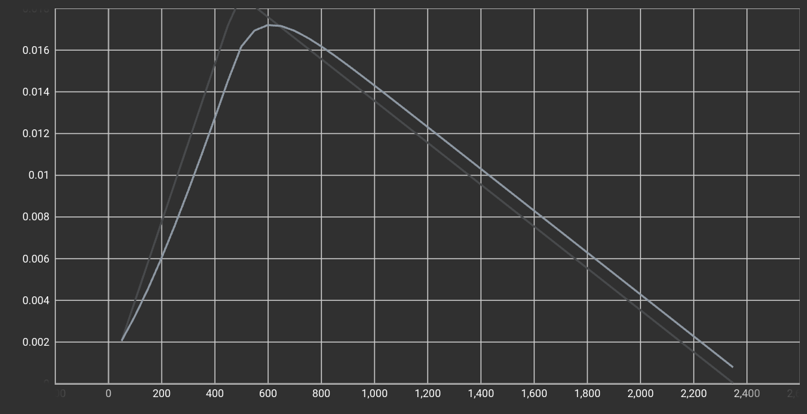
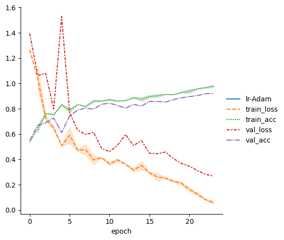
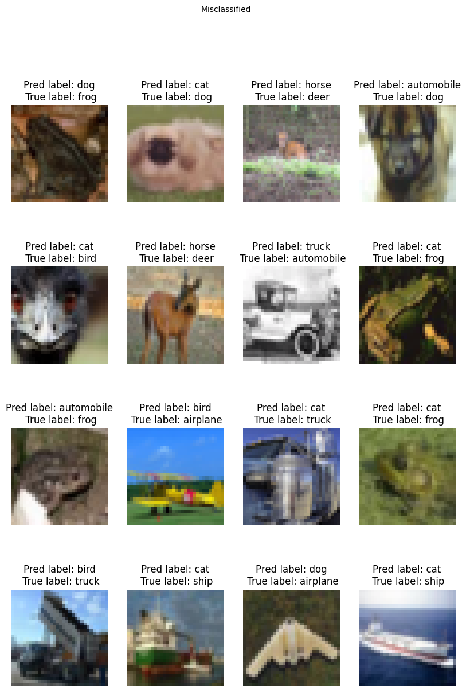
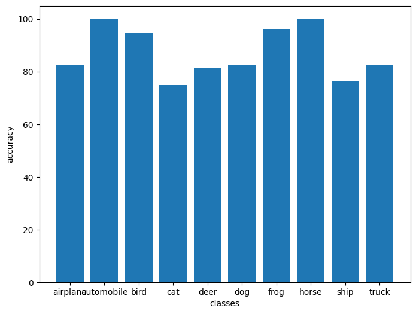

# Submission for Session 10
- [File Structure](#File-Structure)
- [Problem Statement](#Problem-Statement)
- [LR Finding](#LR-Finding)
- [Model Parameters](#Model-Parameters)
- [Accuracy Report](#Accuracy-Report)
- [Learning Rates](#Learning-Rates)
- [Training Logs](#Training-Logs)
- [Results](#Results)
    * [Accuracy Plot](#Accuracy-Plot)
    * [Misclassified Images](#Misclassified-Images)
    * [Accuracy Report for Each class](#Accuracy-Report-for-Each-class )

# File Structure 
* [custom_models](https://github.com/deepanshudashora/custom_models) -> A Repository contains files for training
    * [lightning_playground](https://github.com/deepanshudashora/custom_models/tree/main/lightning_playground) -> For using [pytorch-lightning](https://www.pytorchlightning.ai/index.html) modules 
    * [custom_resnet.py](https://github.com/deepanshudashora/custom_models/blob/main/lightning_playground/modules/custom_resnet.py) -> For importing model architecture
    * [main.py](https://github.com/deepanshudashora/custom_models/blob/main/lightning_playground/main.py) -> Contains training and testing loop 
    * [utils.py](https://github.com/deepanshudashora/custom_models/blob/main/utils.py) -> Contains supportive functions
    * [dataset.py](https://github.com/deepanshudashora/custom_models/blob/main/dataset.py) -> For loading the dataset

* [S12_Training.ipynb](https://github.com/deepanshudashora/ERAV1/blob/master/session12/S12_Training.ipynb) -> Notebook Contains model training
* [csv_logs_training](https://github.com/deepanshudashora/ERAV1/tree/master/session12/csv_logs_training/) -> Contains training logs in csv format
* [tf_logs](https://github.com/deepanshudashora/ERAV1/tree/master/session12/tf_logs) -> Contains tensor-board logs and best model 
  
# Problem Statement
1. Train CNN on cifar dataset with residual blocks
2. Target accuracy -> 90% on the test set 
3. Use torch_lr_finder for finding LR
4. User OneCycleLR as Lr scheduler


# LR Finding 

For finding the Optimal learning rate [torch_lr_finder](https://github.com/davidtvs/pytorch-lr-finder) module is used

```
from torch_lr_finder import LRFinder
model = CustomResnet().to(device)
optimizer = optim.Adam(model.parameters(), lr=0.01, weight_decay=1e-4)
criterion = torch.nn.CrossEntropyLoss()
lr_finder = LRFinder(model, optimizer, criterion, device="cuda")
lr_finder.range_test(train_loader, end_lr=10, num_iter=200, step_mode="exp")
lr_finder.plot() # to inspect the loss-learning rate graph
lr_finder.reset() # to reset the model and optimizer to their initial state
```

<p align="center">
    
</p>


LR suggestion: steepest gradient
Suggested LR: 1.87E-02

For gettting best out of it, model is trained on very high LR till 5th epoch and later till 24th epoch the LR was keep dropping 

# Model Parameters

``````
==========================================================================================
Layer (type:depth-idx)                   Output Shape              Param #
==========================================================================================
CustomResnet                             [512, 10]                 --
├─Sequential: 1-1                        [512, 64, 32, 32]         --
│    └─Conv2d: 2-1                       [512, 64, 32, 32]         1,728
│    └─BatchNorm2d: 2-2                  [512, 64, 32, 32]         128
│    └─ReLU: 2-3                         [512, 64, 32, 32]         --
├─Sequential: 1-2                        [512, 128, 16, 16]        --
│    └─Conv2d: 2-4                       [512, 128, 32, 32]        73,728
│    └─MaxPool2d: 2-5                    [512, 128, 16, 16]        --
│    └─BatchNorm2d: 2-6                  [512, 128, 16, 16]        256
│    └─ReLU: 2-7                         [512, 128, 16, 16]        --
├─Sequential: 1-3                        [512, 128, 16, 16]        --
│    └─Conv2d: 2-8                       [512, 128, 16, 16]        147,456
│    └─BatchNorm2d: 2-9                  [512, 128, 16, 16]        256
│    └─ReLU: 2-10                        [512, 128, 16, 16]        --
│    └─Conv2d: 2-11                      [512, 128, 16, 16]        147,456
│    └─BatchNorm2d: 2-12                 [512, 128, 16, 16]        256
│    └─ReLU: 2-13                        [512, 128, 16, 16]        --
├─Sequential: 1-4                        [512, 256, 8, 8]          --
│    └─Conv2d: 2-14                      [512, 256, 16, 16]        294,912
│    └─MaxPool2d: 2-15                   [512, 256, 8, 8]          --
│    └─BatchNorm2d: 2-16                 [512, 256, 8, 8]          512
│    └─ReLU: 2-17                        [512, 256, 8, 8]          --
├─Sequential: 1-5                        [512, 512, 4, 4]          --
│    └─Conv2d: 2-18                      [512, 512, 8, 8]          1,179,648
│    └─MaxPool2d: 2-19                   [512, 512, 4, 4]          --
│    └─BatchNorm2d: 2-20                 [512, 512, 4, 4]          1,024
│    └─ReLU: 2-21                        [512, 512, 4, 4]          --
├─Sequential: 1-6                        [512, 512, 4, 4]          --
│    └─Conv2d: 2-22                      [512, 512, 4, 4]          2,359,296
│    └─BatchNorm2d: 2-23                 [512, 512, 4, 4]          1,024
│    └─ReLU: 2-24                        [512, 512, 4, 4]          --
│    └─Conv2d: 2-25                      [512, 512, 4, 4]          2,359,296
│    └─BatchNorm2d: 2-26                 [512, 512, 4, 4]          1,024
│    └─ReLU: 2-27                        [512, 512, 4, 4]          --
├─MaxPool2d: 1-7                         [512, 512, 1, 1]          --
├─Linear: 1-8                            [512, 10]                 5,130
==========================================================================================
Total params: 6,573,130
Trainable params: 6,573,130
Non-trainable params: 0
Total mult-adds (G): 194.18
==========================================================================================
Input size (MB): 6.29
Forward/backward pass size (MB): 2382.41
Params size (MB): 26.29
Estimated Total Size (MB): 2414.99
==========================================================================================
``````

# Accuracy Report

|Model Experiments|Found Max LR|Min LR|Best Validation accuracy| Best Training Accuray |
|--|--|--|--|--|
|[Exp-1](https://github.com/deepanshudashora/ERAV1/blob/master/session10/experiments/S10_95_90.ipynb)|3.31E-02|0.023|90.91%|95.88%|
|[Exp-2](https://github.com/deepanshudashora/ERAV1/blob/master/session10/experiments/S10_96_91.ipynb)|2.63E-02|0.02|91.32%|96.95%|
|[Exp-3](https://github.com/deepanshudashora/ERAV1/blob/master/session10/experiments/S10_98_91.ipynb)|1.19E-02|0.01|91.72%|98.77%|
|[Exp-4-TorchCode](https://github.com/deepanshudashora/ERAV1/blob/master/session10/S10.ipynb)|1.87E-02|0.01|91.80%|96.93%|
|[Exp-5-Lightning-precision-16](https://github.com/deepanshudashora/ERAV1/blob/master/session12/S12_Training.ipynb)|1.87E-02|0.01|92.20%|98.8%|

# Learning Rates

<p align="center">
    
</p>

# [Training Logs](https://github.com/deepanshudashora/ERAV1/blob/master/session12/csv_logs_training/lightning_logs/version_0/metrics.csv)
```
         lr-Adam  step  train_loss  train_acc  epoch  val_loss  val_acc
   88   0.005545  1799         NaN        NaN    NaN       NaN      NaN
   89        NaN  1799    0.220482   0.914062   18.0       NaN      NaN
   90   0.005043  1849         NaN        NaN    NaN       NaN      NaN
   91        NaN  1849    0.235307   0.910156   18.0       NaN      NaN
   92        NaN  1861         NaN        NaN   18.0  0.406253   0.8724
   93   0.004541  1899         NaN        NaN    NaN       NaN      NaN
   94        NaN  1899    0.197022   0.925781   19.0       NaN      NaN
   95   0.004039  1949         NaN        NaN    NaN       NaN      NaN
   96        NaN  1949    0.224633   0.933594   19.0       NaN      NaN
   97        NaN  1959         NaN        NaN   19.0  0.367574   0.8873
   98   0.003537  1999         NaN        NaN    NaN       NaN      NaN
   99        NaN  1999    0.175551   0.921875   20.0       NaN      NaN
   100  0.003035  2049         NaN        NaN    NaN       NaN      NaN
   101       NaN  2049    0.148070   0.955078   20.0       NaN      NaN
   102       NaN  2057         NaN        NaN   20.0  0.345555   0.8963
   103  0.002532  2099         NaN        NaN    NaN       NaN      NaN
   104       NaN  2099    0.139945   0.955078   21.0       NaN      NaN
   105  0.002030  2149         NaN        NaN    NaN       NaN      NaN
   106       NaN  2149    0.112343   0.960938   21.0       NaN      NaN
   107       NaN  2155         NaN        NaN   21.0  0.311762   0.9046
   108  0.001528  2199         NaN        NaN    NaN       NaN      NaN
   109       NaN  2199    0.079441   0.972656   22.0       NaN      NaN
   110  0.001026  2249         NaN        NaN    NaN       NaN      NaN
   111       NaN  2249    0.084935   0.962891   22.0       NaN      NaN
   112       NaN  2253         NaN        NaN   22.0  0.282218   0.9190
   113  0.000524  2299         NaN        NaN    NaN       NaN      NaN
   114       NaN  2299    0.074329   0.968750   23.0       NaN      NaN
   115  0.000022  2349         NaN        NaN    NaN       NaN      NaN
   116       NaN  2349    0.043582   0.988281   23.0       NaN      NaN
   117       NaN  2351         NaN        NaN   23.0  0.268215   0.9219

```

# Results

## Accuracy Plot
Here is the Accuracy and Loss metric plot for the model 

<p align="center">
    
</p>


## Misclassified Images
Here is the sample result of model miss-classified images

<p align="center">
    
</p>

## Accuracy Report for Each class   

    Accuracy of airplane : 82 %

    Accuracy of automobile : 100 %

    Accuracy of  bird : 94 %

    Accuracy of   cat : 75 %

    Accuracy of  deer : 81 %

    Accuracy of   dog : 82 %

    Accuracy of  frog : 96 %

    Accuracy of horse : 100 %

    Accuracy of  ship : 76 %

    Accuracy of truck : 82 %
        
<p align="center">
    
</p>
