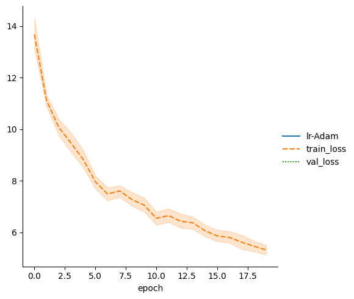
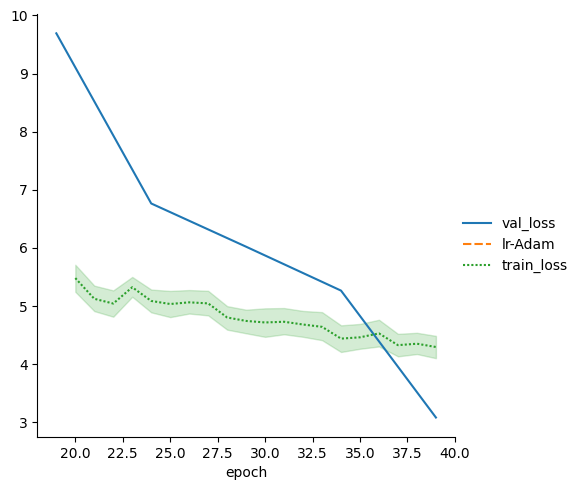
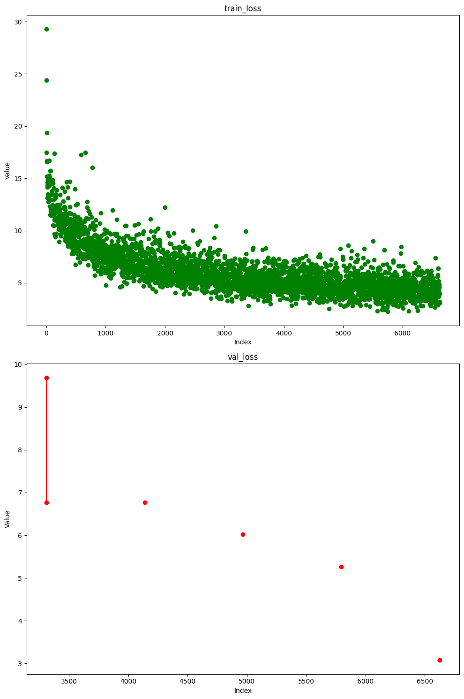

# Submission for Session 10
- [File Structure](#File-Structure)
- [Problem Statement](#Problem-Statement)
- [LR Finding](#LR-Finding)
- [Model Architecture](#Model-Architecture)
- [Accuracy Report](#Accuracy-Report)
- [Training Logs](#Training-Logs)
- [Results](#Results)

# File Structure 
* [custom_models](https://github.com/deepanshudashora/custom_models) -> A Repository contains files for training
    * [torch_version](https://github.com/deepanshudashora/ERAV1/tree/master/session13/torch_version) -> mainly used for reference 
    * [lightning_version](https://github.com/deepanshudashora/ERAV1/tree/master/session13/lightning_version) -> For training the model
* [train_loop_1.ipynb](https://github.com/deepanshudashora/ERAV1/blob/master/session13/lightning_version/train_loop_1.ipynb) -> Contains first training loop (Till 20 epochs)
* [train_loop_2.ipynb](https://github.com/deepanshudashora/ERAV1/blob/master/session13/lightning_version/train_loop_2.ipynb) -> Contains second training loop (From 20 to 40 epochs)
* [evaluation_and_results.ipynb](https://github.com/deepanshudashora/ERAV1/blob/master/session13/lightning_version/evaluation_and_results.ipynb) -> Contains evaluation of model on test set 

# Problem Statement
1. Train Yolov3 on the PASCAL-VOC dataset without any pre-trained Model

# LR Finding 

For finding the Optimal learning rate [torch_lr_finder](https://github.com/davidtvs/pytorch-lr-finder) module is used

```
from torch_lr_finder import LRFinder
model = CustomResnet().to(device)
optimizer = optim.Adam(model.parameters(), lr=0.01, weight_decay=1e-4)
criterion = torch.nn.CrossEntropyLoss()
lr_finder = LRFinder(model, optimizer, criterion, device="cuda")
lr_finder.range_test(train_loader, end_lr=10, num_iter=200, step_mode="exp")
lr_finder.plot() # to inspect the loss-learning rate graph
lr_finder.reset() # to reset the model and optimizer to their initial state
```

# Model Architecture

<p align="center">
    
</p>

# Training Procedure

1. The model is trained on Tesla T4 (15GB GPU memory)
2. The training is completed in two phases
3. In the first training we see loss dropping correctly but in the second training it drops less
4. We run our two training loops separately and do not run any kind of validation on it, except validation loss
5. Later we evaluate the model and get the numbers
6. The lightning generally saves the model as .ckpt format, so we convert it to torch format with saving state dict as .pt format
7. For doing this we use these two lines of code

```
  best_model = torch.load(weights_path)
  torch.save(best_model['state_dict'], f'best_model.pth')
  litemodel = YOLOv3(num_classes=num_classes)
  litemodel.load_state_dict(torch.load("best_model.pth",map_location='cpu'))
  device = "cpu"
  torch.save(litemodel.state_dict(), PATH)
```
   

8. The model starts overfitting on the dataset after 30 epochs
9. Future Improvements
     1. Train the model in 1 shot instead of two different phases
     2. Keep a better batch size (Basically earn more money and buy a good GPU)
     3. Data transformation also plays a vital role here
     4. OneCycle LR range needs to be appropriately modified for a better LR

# Accuracy Report

```
Class accuracy is: 82.999725%
No obj accuracy is: 96.828300%
Obj accuracy is: 76.898473%

MAP: 0.29939851760864258

```

# [Training Logs](https://github.com/deepanshudashora/ERAV1/blob/master/session13/lightning_version/merged_logs.csv)

#### For faster execution we run the validation step after 20 epochs for the first 20 epochs of training and after that after every 5 epochs till 40 epochs

```
      Unnamed: 0   lr-Adam    step  train_loss  epoch  val_loss
8150        8150       NaN  164299    4.186745   39.0       NaN
8151        8151  0.000132  164349         NaN    NaN       NaN
8152        8152       NaN  164349    2.936086   39.0       NaN
8153        8153  0.000132  164399         NaN    NaN       NaN
8154        8154       NaN  164399    4.777130   39.0       NaN
8155        8155  0.000132  164449         NaN    NaN       NaN
8156        8156       NaN  164449    3.139145   39.0       NaN
8157        8157  0.000132  164499         NaN    NaN       NaN
8158        8158       NaN  164499    4.596097   39.0       NaN
8159        8159  0.000132  164549         NaN    NaN       NaN
8160        8160       NaN  164549    5.587294   39.0       NaN
8161        8161  0.000132  164599         NaN    NaN       NaN
8162        8162       NaN  164599    4.592830   39.0       NaN
8163        8163  0.000132  164649         NaN    NaN       NaN
8164        8164       NaN  164649    3.914468   39.0       NaN
8165        8165  0.000132  164699         NaN    NaN       NaN
8166        8166       NaN  164699    3.180615   39.0       NaN
8167        8167  0.000132  164749         NaN    NaN       NaN
8168        8168       NaN  164749    5.772174   39.0       NaN
8169        8169  0.000132  164799         NaN    NaN       NaN
8170        8170       NaN  164799    2.894014   39.0       NaN
8171        8171  0.000132  164849         NaN    NaN       NaN
8172        8172       NaN  164849    4.473828   39.0       NaN
8173        8173  0.000132  164899         NaN    NaN       NaN
8174        8174       NaN  164899    6.397766   39.0       NaN
8175        8175  0.000132  164949         NaN    NaN       NaN
8176        8176       NaN  164949    3.789242   39.0       NaN
8177        8177  0.000132  164999         NaN    NaN       NaN
8178        8178       NaN  164999    5.182691   39.0       NaN
8179        8179  0.000132  165049         NaN    NaN       NaN
8180        8180       NaN  165049    4.845749   39.0       NaN
8181        8181  0.000132  165099         NaN    NaN       NaN
8182        8182       NaN  165099    3.672542   39.0       NaN
8183        8183  0.000132  165149         NaN    NaN       NaN
8184        8184       NaN  165149    4.230726   39.0       NaN
8185        8185  0.000132  165199         NaN    NaN       NaN
8186        8186       NaN  165199    4.625024   39.0       NaN
8187        8187  0.000132  165249         NaN    NaN       NaN
8188        8188       NaN  165249    6.549682   39.0       NaN
8189        8189  0.000132  165299         NaN    NaN       NaN
8190        8190       NaN  165299    5.040627   39.0       NaN
8191        8191  0.000132  165349         NaN    NaN       NaN
8192        8192       NaN  165349    5.857126   39.0       NaN
8193        8193  0.000132  165399         NaN    NaN       NaN
8194        8194       NaN  165399    3.081895   39.0       NaN
8195        8195  0.000132  165449         NaN    NaN       NaN
8196        8196       NaN  165449    3.945353   39.0       NaN
8197        8197  0.000132  165499         NaN    NaN       NaN
8198        8198       NaN  165499    3.513420   39.0       NaN
8199        8199       NaN  165519         NaN   39.0  6.084875


```

# Results

## For epochs 0 to 19

<p align="center">
    
</p>

## From 19 to 20

<p align="center">
    
</p>

## Full training logs for loss

<p align="center">
    
</p>

