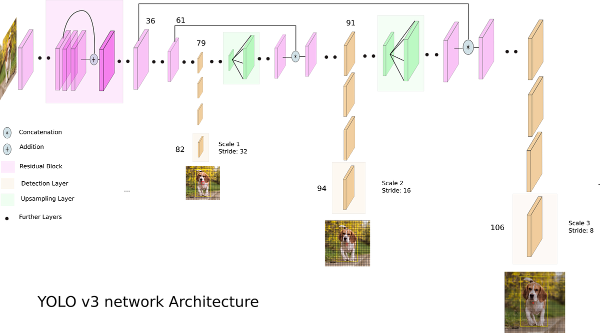

# Submission for Session 10
- [File Structure](#File-Structure)
- [Problem Statement](#Problem-Statement)
- [LR Finding](#LR-Finding)
- [Model Architecture](#Model-Architecture)
- [Accuracy Report](#Accuracy-Report)
- [Training Logs](#Training-Logs)
- [Results](#Results)

# File Structure 
* [custom_models](https://github.com/deepanshudashora/custom_models) -> A Repository contains files for training
    * [torch_version](https://github.com/deepanshudashora/ERAV1/tree/master/session13/torch_version) -> mainly used for reference 
    * [lightning_version](https://github.com/deepanshudashora/ERAV1/tree/master/session13/lightning_version) -> For training the model
 
      #### [Experiments](https://github.com/deepanshudashora/ERAV1/tree/master/session13/lightning_version/Experiments)
      * [train_loop_1.ipynb](https://github.com/deepanshudashora/ERAV1/blob/master/session13/lightning_version/Experiments/train_loop_1.ipynb) -> Contains first training loop (Till 20 epochs)
      * [train_loop_2.ipynb](https://github.com/deepanshudashora/ERAV1/blob/master/session13/lightning_version/Experiments/train_loop_2.ipynb) -> Contains second training loop (From 20 to 40 epochs)

 *  [training.ipynb](https://github.com/deepanshudashora/ERAV1/blob/master/session13/lightning_version/training.ipynb) -> Contains parallel GPU training code
 *   [final_evaluation.ipynb](https://github.com/deepanshudashora/ERAV1/blob/master/session13/lightning_version/final_evaluation.ipynb) -> Contains accuracy test and evaluation of model

# Problem Statement
1. Train Yolov3 on the PASCAL-VOC dataset without any pre-trained Model
2. Host it as a hugging face app 


# [Huggingface APP](https://huggingface.co/spaces/wgetdd/YoloV3-PASCAL-VOC)

# LR Finding 

For finding the Optimal learning rate [torch_lr_finder](https://github.com/davidtvs/pytorch-lr-finder) module is used

```
from torch_lr_finder import LRFinder
model = CustomResnet().to(device)
optimizer = optim.Adam(model.parameters(), lr=0.01, weight_decay=1e-4)
criterion = torch.nn.CrossEntropyLoss()
lr_finder = LRFinder(model, optimizer, criterion, device="cuda")
lr_finder.range_test(train_loader, end_lr=10, num_iter=200, step_mode="exp")
lr_finder.plot() # to inspect the loss-learning rate graph
lr_finder.reset() # to reset the model and optimizer to their initial state
```

# Model Architecture

<p align="center">
    
</p>

# Training Procedure

#### [Experiment 1](https://github.com/deepanshudashora/ERAV1/tree/master/session13/lightning_version/Experiments)
   1. The model is trained on Tesla T4 (15GB GPU memory)
   2. The training is completed in two phases
   3. The first phase contains 20 epochs and the second phase contains another 20 epochs
   4. In the first training we see loss dropping correctly but in the second training it drops less
   5. We run our two training loops separately and do not run any kind of validation on them, except for validation loss

#### [Experiment 2](https://github.com/deepanshudashora/ERAV1/tree/master/session13/lightning_version)
   1. The model is trained on 2 Tesla t4 GPUs, with distributed training using PyTorch lightning
   2. For doing the distributed training we use the strategy ```ddp_notebook_find_unused_parameters_true```

* Later we evaluate the model and get the numbers
* The lightning generally saves the model as .ckpt format, so we convert it to torch format by saving state dict as .pt format
* For doing this we use these two lines of code

```
  best_model = torch.load(weights_path)
  torch.save(best_model['state_dict'], f'best_model.pth')
  litemodel = YOLOv3(num_classes=num_classes)
  litemodel.load_state_dict(torch.load("best_model.pth",map_location='cpu'))
  device = "cpu"
  torch.save(litemodel.state_dict(), PATH)
```
   

* The model starts overfitting on the dataset after 30 epochs
* Future Improvements
     1. Train the model in 1 shot instead of two different phases
     2. Keep a better batch size (Basically earn more money and buy a good GPU)
     3. Data transformation also plays a vital role here
     4. OneCycle LR range needs to be appropriately modified for a better LR
      


# Data Transformation

Along with the transforms mentioned in the [config file](https://github.com/deepanshudashora/ERAV1/blob/master/session13/lightning_version/config.py), we also apply **mosaic transform** on 75% images 

[Reference](https://www.kaggle.com/code/nvnnghia/awesome-augmentation/notebook)

# Accuracy Report

```
Class accuracy is: 85.015236%
No obj accuracy is: 98.248817%
Obj accuracy is: 68.054863%

MAP: 0.4670606553554535

```

# [Training Logs](https://github.com/deepanshudashora/ERAV1/blob/master/session13/lightning_version/training_logs/csv_training_logs/lightning_logs/version_0/metrics.csv)

#### For faster execution we run the validation step after 20 epochs for the first 20 epochs of training and after that after every 5 epochs till 40 epochs

```
         lr-Adam   step  train_loss  epoch  val_loss
   786       NaN  19499    4.653981   37.0       NaN
   787  0.000160  19549         NaN    NaN       NaN
   788       NaN  19549    4.864988   37.0       NaN
   789  0.000160  19599         NaN    NaN       NaN
   790       NaN  19599    5.241925   37.0       NaN
   791  0.000160  19649         NaN    NaN       NaN
   792       NaN  19649    5.020171   37.0       NaN
   793  0.000161  19699         NaN    NaN       NaN
   794       NaN  19699    4.245292   38.0       NaN
   795  0.000161  19749         NaN    NaN       NaN
   796       NaN  19749    4.541957   38.0       NaN
   797  0.000161  19799         NaN    NaN       NaN
   798       NaN  19799    3.837740   38.0       NaN
   799  0.000161  19849         NaN    NaN       NaN
   800       NaN  19849    4.239679   38.0       NaN
   801  0.000161  19899         NaN    NaN       NaN
   802       NaN  19899    4.034101   38.0       NaN
   803  0.000161  19949         NaN    NaN       NaN
   804       NaN  19949    5.010788   38.0       NaN
   805  0.000161  19999         NaN    NaN       NaN
   806       NaN  19999    3.980245   38.0       NaN
   807  0.000161  20049         NaN    NaN       NaN
   808       NaN  20049    4.641729   38.0       NaN
   809  0.000161  20099         NaN    NaN       NaN
   810       NaN  20099    4.563717   38.0       NaN
   811  0.000161  20149         NaN    NaN       NaN
   812       NaN  20149    4.422552   38.0       NaN
   813  0.000161  20199         NaN    NaN       NaN
   814       NaN  20199    4.925357   38.0       NaN
   815  0.000161  20249         NaN    NaN       NaN
   816       NaN  20249    4.788391   39.0       NaN
   817  0.000161  20299         NaN    NaN       NaN
   818       NaN  20299    4.478580   39.0       NaN
   819  0.000161  20349         NaN    NaN       NaN
   820       NaN  20349    4.624731   39.0       NaN
   821  0.000161  20399         NaN    NaN       NaN
   822       NaN  20399    4.425498   39.0       NaN
   823  0.000161  20449         NaN    NaN       NaN
   824       NaN  20449    4.361921   39.0       NaN
   825  0.000161  20499         NaN    NaN       NaN
   826       NaN  20499    4.318252   39.0       NaN
   827  0.000161  20549         NaN    NaN       NaN
   828       NaN  20549    4.013813   39.0       NaN
   829  0.000161  20599         NaN    NaN       NaN
   830       NaN  20599    4.476331   39.0       NaN
   831  0.000161  20649         NaN    NaN       NaN
   832       NaN  20649    4.192605   39.0       NaN
   833  0.000161  20699         NaN    NaN       NaN
   834       NaN  20699    4.065756   39.0       NaN
   835       NaN  20719         NaN   39.0  4.348697

```

# Results

## loss curve

<p align="center">
    
</p>


