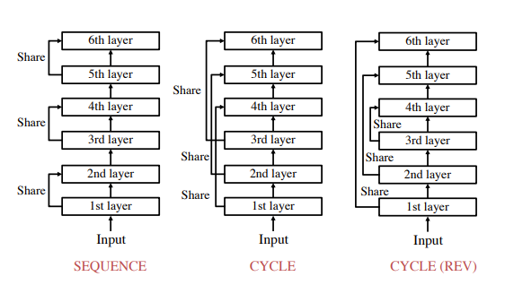

# Submission for Session 15

- [File Structure](#File-Structure)
- [Problem Statement](#Problem-Statement)
- [LR Finding](#LR-Finding)
- [Training Logs](#Training-Logs)

# Contributers

[Anant Gupta](https://github.com/anantgupta129)

[Deepanshu Dashora](https://github.com/deepanshudashora/)

# File Structure

* [TorcHood](https://github.com/anantgupta129/TorcHood/tree/main) -> TorcHood, a repository which makes torch and lightning training easy, [checkout the training guide to start using it](https://github.com/anantgupta129/TorcHood/tree/main/docs)
* [torchood](https://github.com/anantgupta129/TorcHood/tree/main/torchood) -> For using data modules, utils and models for training
* [bilang_module.py](https://github.com/anantgupta129/TorcHood/blob/main/torchood/models/bilang_module.py) -> Contains lightning code for trainer
* [opus_datamodule.py](https://github.com/anantgupta129/TorcHood/blob/main/torchood/data/opus_datamodule.py) -> Contains lightning code for dataset
* [opus_books.py](https://github.com/anantgupta129/TorcHood/blob/trf_speed_up/torchood/data/components/opus_books.py) -> Contains dataset prepration class with dynamic padding
* [trainig configuration](https://github.com/anantgupta129/TorcHood/blob/main/torchood/configs/bilang_config.py) -> Contains hyperparameters used in training
* [S16 Training notebook](train.ipynb) -> Notebook Contains model training
* [Wandb Logs](https://wandb.ai/anantgupta129/Transformers-BiLang/workspace?workspace=user-anantgupta129) -> Contains tensor-board logs and best model

# Problem Statement

1. Pick the "en-fr" dataset from opus_books
2. Remove all English sentences with more than 150 "tokens"
3. Remove all french sentences where len(fench_sentences) > len(english_sentrnce) + 10
4. Train you own transformer and get your loss under 1.8

# [LR Finding](https://github.com/anantgupta129/TorcHood/tree/main/torchood/utils)

For finding the Optimal learning rate we use [torchood&#39;s autolr finder](https://github.com/anantgupta129/TorcHood/blob/main/torchood/utils/helper.py)

# Model Parameters

``````

┏━━━┳━━━━━━━━━━━━━━━━━┳━━━━━━━━━━━━━━━━━━┳━━━━━━━━┓

┃   ┃ Name            ┃ Type             ┃ Params ┃

┡━━━╇━━━━━━━━━━━━━━━━━╇━━━━━━━━━━━━━━━━━━╇━━━━━━━━┩

│ 0 │ net             │ Transformer      │ 75.1 M │

└───┴─────────────────┴──────────────────┴────────┘


``````

# [Dynamic Padding](https://github.com/anantgupta129/TorcHood/blob/trf_speed_up/torchood/data/components/opus_books.py)

In the real world of Natural Language Processing (NLP), dealing with text data of varying lengths is a common challenge. When we aim to process such data in batches, it's crucial that all sequences within a batch have the same length to create a uniform matrix representation. Achieving this uniformity involves a technique known as "dynamic padding."

<p align="center">
    
</p>

Dynamic padding involves modifying sequences to reach a common length within each batch, ensuring efficient processing in Transformer models. Rather than applying a fixed padding length across all sequences, dynamic padding adapts to the specific requirements of each batch.

Instead of rigidly appending a fixed number of pad tokens to each sequence, we limit the number of added pad tokens to match the length of the longest sequence within the batch. This flexibility minimizes the unnecessary use of pad tokens and is why we call it "dynamic" padding.

The pad token, typically representing no meaningful word, needs to be handled carefully during computations. Before calculating the loss, we nullify the pad token's impact by multiplying it by 0 through an "attention mask" matrix for each sample. This mask identifies and instructs the Transformer to disregard the \[PAD\] tokens during processing.

<p align="center">
    
</p>

To further enhance efficiency, we strive to create batches with sequences of similar lengths. This approach helps us avoid situations where most sequences in a mini-batch are short, requiring the addition of numerous pad tokens to each of them due to the presence of a single very long sequence.

By implementing dynamic padding and optimizing batch generation, we ensure that Transformer models can efficiently handle real-world NLP datasets with varying sequence lengths, leading to more effective and resource-efficient NLP applications.

<p align="center">
    
</p>

# [Parameter Sharing](https://github.com/anantgupta129/TorcHood/blob/trf_speed_up/torchood/models/components/bilang_transformer.py)

[REFERENCE](https://arxiv.org/pdf/2104.06022.pdf)

<p align="center">
    
</p>

There are three major types for parameter sharing

1. Sequence : The simplest strategy is to assign the same parameters to sequential⌊N/M⌋ layers.We name this strategy SEQUENCE.For example,when we set M=3 and N=6,two sequential layers share their parameters as illustrated in Figure, Imagine group of 6 friends sharing 3 toys together, where 2 friends needs to share same toy

2. Cycle : In CYCLE ,we stack M layers whose parameters are independent from each other.Then,we repeat stacking the M layers with the identical order to the first M layers until the total number of layers reaches N.When we set M=3 and N=6,we stack 3 layers twice as illustrated in Figure.  For example you start with 3 friends and 3 different toys. You give them each a toy just like before. Then, you do it again with the same 3 toys for the next 3 friends. It's like going around in a circle twice. So, each friend has a different toy, and you follow this cycle of sharing.

3. CYCLE(REV) : In this strategy,we repeat stacking M layers in the same manner as CYCLE until M∗(⌈N/M⌉−1) layers.For the remaining layers, we stack M layers in the reverse order.When we set M=3 and N=6,we stack 3 layers and then stack the 3 layers in the reverse order as in Figure .Thus,the lowest layer and highest layer share parameters. For example you start with 3 friends again, and they each get a different toy, just like before. But this time, for the last 3 friends, you give them the same toys in the opposite order. So, the first friend gets the last toy, the second friend gets the second-to-last toy, and the third friend gets the first toy. It's like sharing toys in a special way!


# [Training Logs](https://wandb.ai/anantgupta129/Transformers-BiLang/reports/Transformers-Bi-Language-Model-on-Opus-Books-Dataset--Vmlldzo1MzQyNDU1)

```

Epoch 0/9  ━━━━━━━━━━━━━━━━━━━━━━━━━━━━━━━━━━━━━━ 910/910 0:06:22 • 0:00:00 2.41it/s v_num: mcyz train/loss: 3.977 

Epoch 1/9  ━━━━━━━━━━━━━━━━━━━━━━━━━━━━━━━━━━ 910/910 0:05:58 • 0:00:00 2.55it/s v_num: mcyz train/loss: 2.903   

                                                                                 val/cer: 5.01 val/wer: 15.263   


Epoch 2/9  ━━━━━━━━━━━━━━━━━━━━━━━━━━━━━━━━━━ 910/910 0:06:01 • 0:00:00 2.55it/s v_num: mcyz train/loss: 2.12  

                                                                                 val/cer: 4.795 val/wer: 14.441  


Epoch 3/9  ━━━━━━━━━━━━━━━━━━━━━━━━━━━━━━━━━━ 910/910 0:05:59 • 0:00:00 2.55it/s v_num: mcyz train/loss: 1.943   

                                                                                 val/cer: 3.504 val/wer: 9.555   


Epoch 4/9  ━━━━━━━━━━━━━━━━━━━━━━━━━━━━━━━━━━ 910/910 0:05:58 • 0:00:00 2.56it/s v_num: mcyz train/loss: 1.711   

                                                                                 val/cer: 4.444 val/wer: 13.538  


Epoch 5/9  ━━━━━━━━━━━━━━━━━━━━━━━━━━━━━━━━━━ 910/910 0:05:58 • 0:00:00 2.56it/s v_num: mcyz train/loss: 1.631   

                                                                                 val/cer: 3.597 val/wer: 11.055  


Epoch 6/9  ━━━━━━━━━━━━━━━━━━━━━━━━━━━━━━━━━━ 910/910 0:05:58 • 0:00:00 2.56it/s v_num: mcyz train/loss: 1.545   

                                                                                 val/cer: 3.717 val/wer: 11.277  


Epoch 7/9  ━━━━━━━━━━━━━━━━━━━━━━━━━━━━━━━━━━ 910/910 0:06:19 • 0:00:00 2.40it/s v_num: mcyz train/loss: 1.489   

                                                                                 val/cer: 3.938 val/wer: 12.006  


Epoch 8/9  ━━━━━━━━━━━━━━━━━━━━━━━━━━━━━━━━━━ 910/910 0:05:58 • 0:00:00 2.56it/s v_num: mcyz train/loss: 1.447   

                                                                                 val/cer: 6.109 val/wer: 13.8  


Epoch 9/9  ━━━━━━━━━━━━━━━━━━━━━━━━━━━━━━━━━━ 910/910 0:05:58 • 0:00:00 2.56it/s v_num: mcyz train/loss: 1.438   

                                                                                 val/cer: 4.04 val/wer: 11.597


```

# Results

- training loss: 1.438
