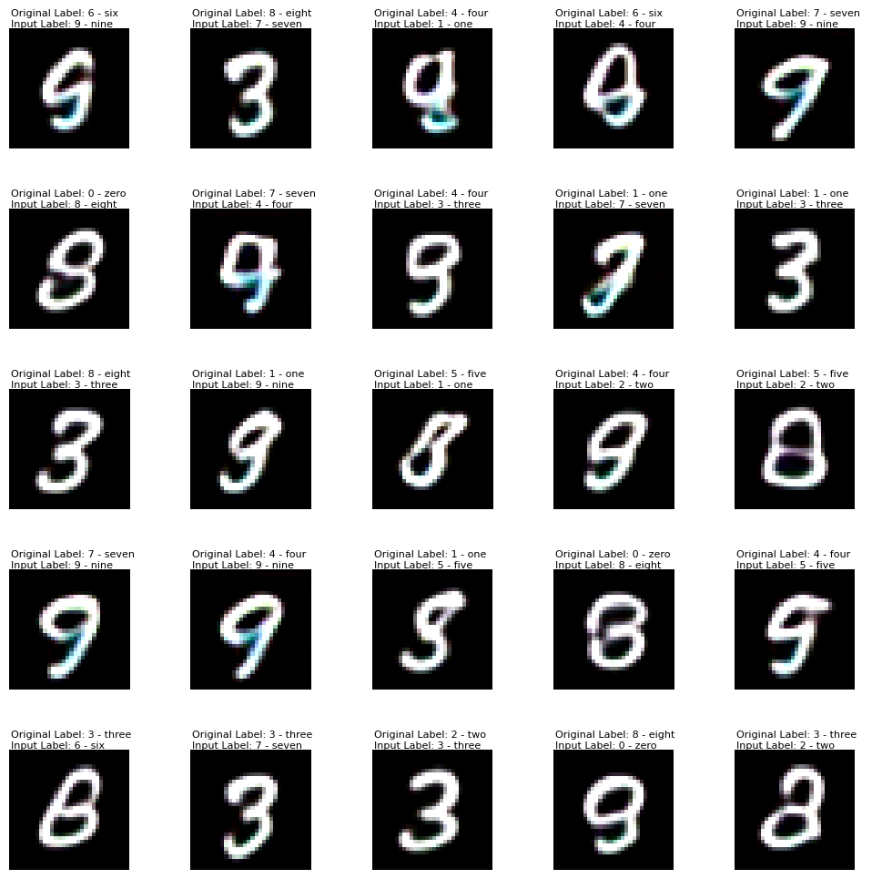
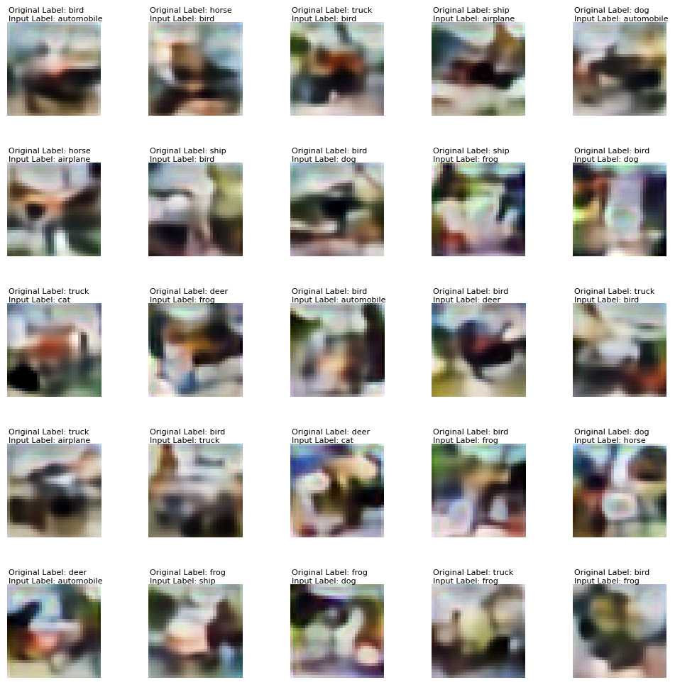

# Submission for Session 16

- [File Structure](#File-Structure)
- [Problem Statement](#Problem-Statement)
- [Training Logs](#Training-Logs)

# Contributers

[Anant Gupta](https://github.com/anantgupta129)

[Deepanshu Dashora](https://github.com/deepanshudashora/)

# File Structure

* [TorcHood](https://github.com/anantgupta129/TorcHood/tree/main) -> TorcHood, a repository which makes torch and lightning training easy, [checkout the training guide to start using it](https://github.com/anantgupta129/TorcHood/tree/main/docs)
* [torchood](https://github.com/anantgupta129/TorcHood/tree/main/torchood) -> For using data modules, utils and models for training
* [unet_module.py](https://github.com/anantgupta129/TorcHood/blob/main/torchood/models/unet_module.py) -> UNET lightning module
* [unet.py](https://github.com/anantgupta129/TorcHood/blob/main/torchood/models/components/unet.py) -> UNET Main Model
* [variational_auto_encoders_module.py](https://github.com/anantgupta129/TorcHood/blob/main/torchood/models/variational_auto_encoders_module.py) -> lightning module for VAE
* [variational_auto_encoder.py](https://github.com/anantgupta129/TorcHood/blob/main/torchood/models/components/variational_auto_encoder.py) -> VAE Model
* [S16 Training notebook](train.ipynb) -> Notebook Contains model training
* [Wandb Logs For UNET](https://wandb.ai/anantgupta129/Unet-Oxford-Iiit-Pets/workspace?workspace=user-anantgupta129) -> Training Logs of UNET
* [Wandb Logs for VAE MNIST](https://wandb.ai/deepanshudashora/VAE-MNIST/workspace?workspace=user-deepanshudashora) -> Training Logs VAE Training on MNIST dataset
* [Wandb Logs for VAE CIFAR10](https://wandb.ai/deepanshudashora/VAE-CIFAR?workspace=user-deepanshudashora) -> Training Logs VAE Training on CIFAR10 dataset

# Problem Statement

1. Train UNET on 
    * MP+Tr+BCE
    * MP+Tr+Dice Loss
    * StrConv+Tr+BCE
    * StrConv+Ups+Dice Loss

2. Train VAE ON
    * MNIST Dataset
    * CIFAR10 Dataset

# Results

## For UNET 

    

## For VAE on MNIST 

    

## For VAE on CIFAR10

    

