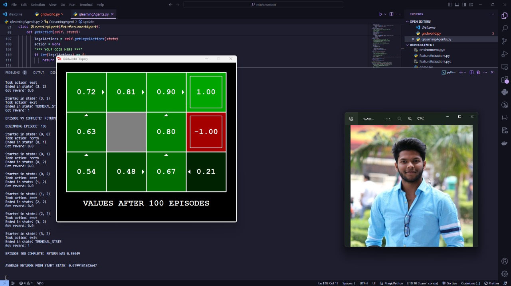

# Submission for Session 20

- [File Structure](#File-Structure)
- [Problem Statement](#Problem-Statement)
- [Outputs](#Outputs)
- [References](#References)

# Contributers

[Anant Gupta](https://github.com/anantgupta129)

[Deepanshu Dashora](https://github.com/deepanshudashora/)

# File Structure

* [Car Game](https://github.com/deepanshudashora/ERAV1/blob/master/session24/car_game) -> Contains code for running a self driving car to find roads
* [reinforcement_UCBerkeley](https://github.com/deepanshudashora/ERAV1/blob/master/session24/reinforcement_UCBerkeley) -> Contains code for performing reinforcement leanring basics for achiving reward and penalty on small puzzle

# Problem Statement

***Perform Experiments on different maps for running the car and figuring out the roads***

***Perform Experiments on puzzle game to achive reward as soon as possible***

# Outputs

    

### [**youtube video link for car game**]()