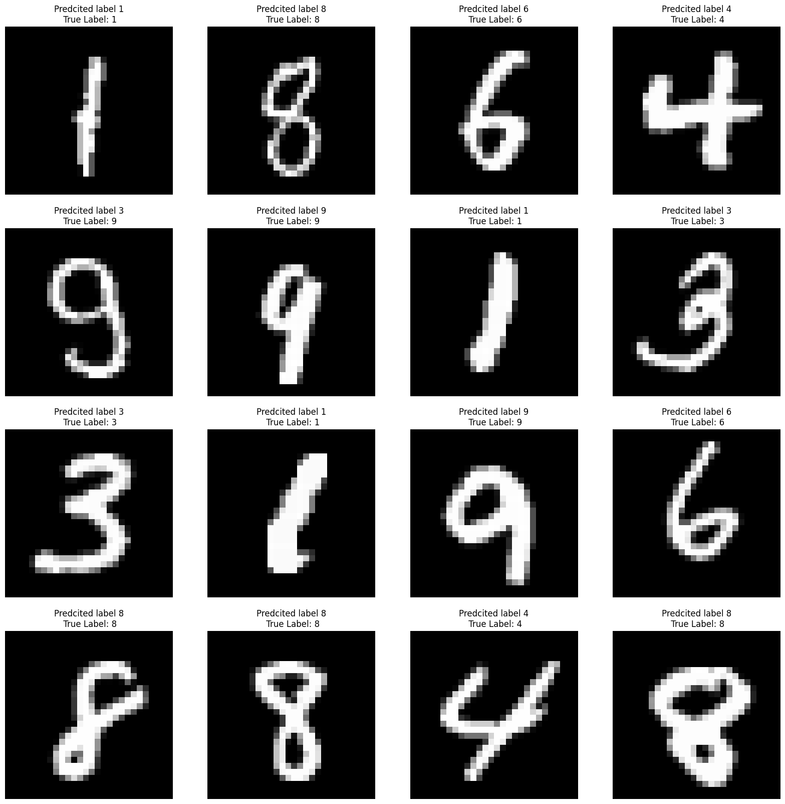

# Submission for Week 5
- [Problem Statement](#Problem-Statement)
- [Model Parameters](#Model-Parameters)
- [Receptive Field and Output Shape Calculation of Layers](#Receptive-Field-and-Output-Shape-Calculation-of-Layers)
- [Results](#Results)
    * [Accuracy Plot](#Accuracy-Plot)
    * [Sample Output](#Sample-Output)
    * [Misclassified Images](#Misclassified-Images)

# Problem Statement

1. Re-look at the code that we worked on in Assignment 4 (the fixed version)
2. Move the contents of the code to the following files -> model.py, utils.py and s5.ipynb
3. Make the whole code run again
4. Upload the code with the 4 files + README.md file to GitHub. README.md (look at the spelling) must have details about this code and how to read your code (what file does what). Heavy negative scores for not formatting your markdown file into p, H1, H2, list, etc.
5. Attempt this assignment

# Model Parameters

----------------------------------------------------------------
        Layer (type)               Output Shape         Param #
----------------------------------------------------------------
            Conv2d-1           [-1, 32, 26, 26]             320
            Conv2d-2           [-1, 64, 24, 24]          18,496
            Conv2d-3          [-1, 128, 10, 10]          73,856
            Conv2d-4            [-1, 256, 8, 8]         295,168
            Linear-5                   [-1, 50]         204,850
            Linear-6                   [-1, 10]             510

----------------------------------------------------------------
    Total params: 593,200
    Trainable params: 593,200
    Non-trainable params: 0
----------------------------------------------------------------
    Input size (MB): 0.00
    Forward/backward pass size (MB): 0.67
    Params size (MB): 2.26
    Estimated Total Size (MB): 2.94
----------------------------------------------------------------

# Receptive Field and Output Shape Calculation of Layers

Layer |  receptive-field_in |  n_in |   j_in |   stride |  padding |  kernel_size  | recptive-field out | n_out |  j_out   
--- | --- | --- | --- |--- |--- |--- |--- |--- |--- |
conv1 |  1 |  28|  1 |  1 |  0 |  3 |  3 |  26 | 1  | 
conv2 |  3  | 26 | 1  | 1  | 0 |  3  | 5  | 24 | 1  | 
maxpool |5 |  24 | 1 |  2 |  0 |  2  | 6  | 12 | 2  | 
conv3 |  6 |  12|  2 |  1 |  0 |  3  | 10 | 10 | 2  | 
conv4 |  10 | 10| 2  | 1  | 0  | 3  | 14 | 8|   2  |
maxpool| 14 | 8 |  2 |  2 |  0|   2|   16|  4 |  4|   

# Training Logs

    Adjusting learning rate of group 0 to 1.0000e-02.
    Epoch 1
    Train: Loss=2.2888 Batch_id=14 Accuracy=10.25:  24%|██▎       | 14/59 [00:09<00:28,  1.60it/s]INFO:utils:Train: Loss=2.2888 Batch_id=14 Accuracy=10.25
    Train: Loss=2.2189 Batch_id=29 Accuracy=17.22:  47%|████▋     | 28/59 [00:15<00:11,  2.67it/s]INFO:utils:Train: Loss=2.2189 Batch_id=29 Accuracy=17.22
    Train: Loss=1.1192 Batch_id=44 Accuracy=29.72:  75%|███████▍  | 44/59 [00:20<00:05,  2.91it/s]INFO:utils:Train: Loss=1.1192 Batch_id=44 Accuracy=29.72
    Train: Loss=1.5305 Batch_id=58 Accuracy=36.05: 100%|██████████| 59/59 [00:25<00:00,  2.30it/s]
    INFO:utils:Test set: Average loss: 1.3531, Accuracy: 6476/10000 (64.76%)

    Test set: Average loss: 1.3531, Accuracy: 6476/10000 (64.76%)

    Adjusting learning rate of group 0 to 1.0000e-02.
    Epoch 2
    Train: Loss=0.5771 Batch_id=14 Accuracy=74.43:  22%|██▏       | 13/59 [00:05<00:16,  2.86it/s]INFO:utils:Train: Loss=0.5771 Batch_id=14 Accuracy=74.43
    Train: Loss=0.3899 Batch_id=29 Accuracy=80.38:  49%|████▉     | 29/59 [00:11<00:11,  2.54it/s]INFO:utils:Train: Loss=0.3899 Batch_id=29 Accuracy=80.38
    Train: Loss=0.3296 Batch_id=44 Accuracy=83.58:  73%|███████▎  | 43/59 [00:16<00:05,  2.90it/s]INFO:utils:Train: Loss=0.3296 Batch_id=44 Accuracy=83.58
    Train: Loss=0.2875 Batch_id=58 Accuracy=85.55: 100%|██████████| 59/59 [00:22<00:00,  2.67it/s]
    INFO:utils:Test set: Average loss: 0.1744, Accuracy: 9484/10000 (94.84%)

    Test set: Average loss: 0.1744, Accuracy: 9484/10000 (94.84%)

    Adjusting learning rate of group 0 to 1.0000e-03.
    Epoch 3
    Train: Loss=0.2550 Batch_id=14 Accuracy=92.74:  24%|██▎       | 14/59 [00:05<00:15,  2.96it/s]INFO:utils:Train: Loss=0.2550 Batch_id=14 Accuracy=92.74
    Train: Loss=0.2309 Batch_id=29 Accuracy=92.99:  49%|████▉     | 29/59 [00:11<00:14,  2.12it/s]INFO:utils:Train: Loss=0.2309 Batch_id=29 Accuracy=92.99
    Train: Loss=0.2079 Batch_id=44 Accuracy=93.19:  75%|███████▍  | 44/59 [00:16<00:04,  3.03it/s]INFO:utils:Train: Loss=0.2079 Batch_id=44 Accuracy=93.19
    Train: Loss=0.1856 Batch_id=58 Accuracy=93.20: 100%|██████████| 59/59 [00:21<00:00,  2.76it/s]
    INFO:utils:Test set: Average loss: 0.1557, Accuracy: 9537/10000 (95.37%)

    Test set: Average loss: 0.1557, Accuracy: 9537/10000 (95.37%)

    Adjusting learning rate of group 0 to 1.0000e-03.
    Epoch 4
    Train: Loss=0.2396 Batch_id=14 Accuracy=93.26:  22%|██▏       | 13/59 [00:05<00:15,  3.00it/s]INFO:utils:Train: Loss=0.2396 Batch_id=14 Accuracy=93.26
    Train: Loss=0.2398 Batch_id=29 Accuracy=93.31:  49%|████▉     | 29/59 [00:10<00:12,  2.45it/s]INFO:utils:Train: Loss=0.2398 Batch_id=29 Accuracy=93.31
    Train: Loss=0.1598 Batch_id=44 Accuracy=93.52:  73%|███████▎  | 43/59 [00:16<00:05,  2.90it/s]INFO:utils:Train: Loss=0.1598 Batch_id=44 Accuracy=93.52
    Train: Loss=0.2128 Batch_id=58 Accuracy=93.54: 100%|██████████| 59/59 [00:21<00:00,  2.80it/s]
    INFO:utils:Test set: Average loss: 0.1457, Accuracy: 9565/10000 (95.65%)

    Test set: Average loss: 0.1457, Accuracy: 9565/10000 (95.65%)

    Adjusting learning rate of group 0 to 1.0000e-04.
    Epoch 5
    Train: Loss=0.1590 Batch_id=14 Accuracy=93.80:  22%|██▏       | 13/59 [00:06<00:16,  2.81it/s]INFO:utils:Train: Loss=0.1590 Batch_id=14 Accuracy=93.80
    Train: Loss=0.1819 Batch_id=29 Accuracy=93.74:  49%|████▉     | 29/59 [00:12<00:12,  2.37it/s]INFO:utils:Train: Loss=0.1819 Batch_id=29 Accuracy=93.74
    Train: Loss=0.1981 Batch_id=44 Accuracy=93.74:  73%|███████▎  | 43/59 [00:17<00:05,  2.95it/s]INFO:utils:Train: Loss=0.1981 Batch_id=44 Accuracy=93.74
    Train: Loss=0.1888 Batch_id=58 Accuracy=93.72: 100%|██████████| 59/59 [00:22<00:00,  2.67it/s]
    INFO:utils:Test set: Average loss: 0.1431, Accuracy: 9570/10000 (95.70%)

    Test set: Average loss: 0.1431, Accuracy: 9570/10000 (95.70%)

    Adjusting learning rate of group 0 to 1.0000e-04.

# Results

## Accuracy Plot
Here is the Accuracy and Loss metric plot for the model 

## Sample Output
Here is the sample result of model classification 

## Misclassified Images
Here is the sample result of model miss-classified images

