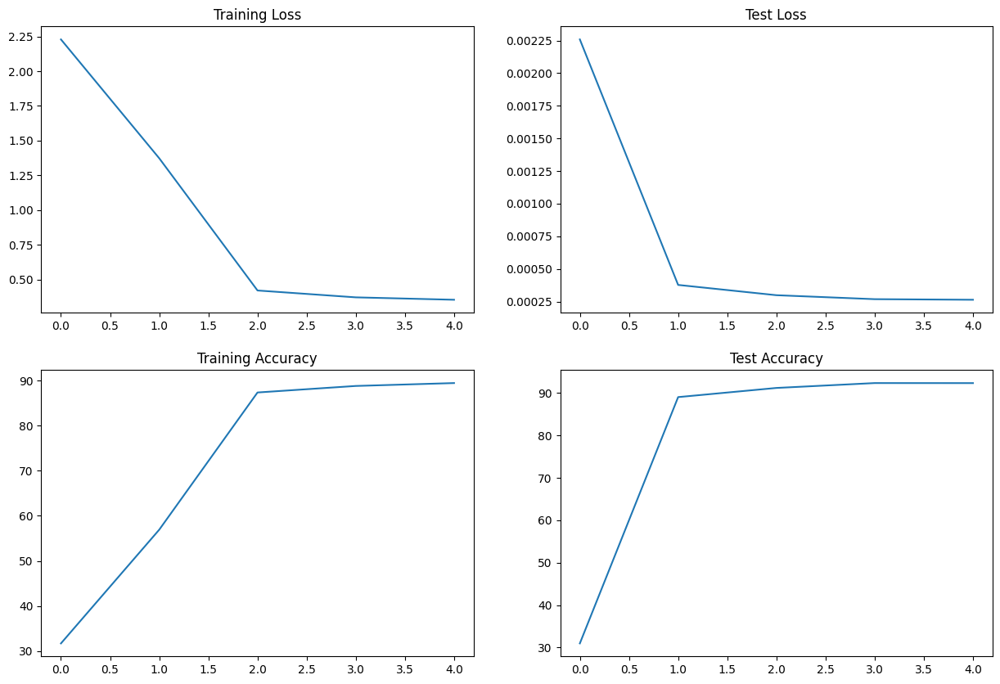
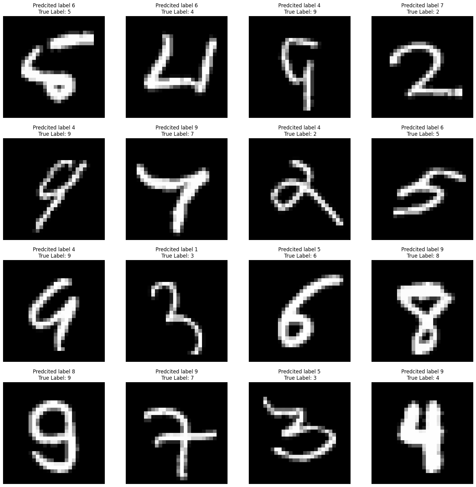

# Submission for Week 5
- [Problem Statement](#Problem-Statement)
- [File Structure](#File-Structure)
- [Model Parameters](#Model-Parameters)
- [Receptive Field and Output Shape Calculation of Layers](#Receptive-Field-and-Output-Shape-Calculation-of-Layers)
- [Results](#Results)
    * [Accuracy Plot](#Accuracy-Plot)
    * [Sample Output](#Sample-Output)
    * [Misclassified Images](#Misclassified-Images)
    * [Accuracy Report for Each class](#Accuracy-Report-for-Each-class )

# File Structure
* model.py 
    * Contains Model Architecture
* utils.py
    * Contains all the functions which are required to initiate the training
        * Contains data augmentation
        * Test and Train functions 
        * Plotting Misclassified results and random prediction code 
        * Contains code for plotting the accuracy and loss plot on test and train set
* S5.ipynb
    * contains execution of imports from these files
    * One file which compiles down all the code required for training
* logs/ 
    * collects logs from each and every file 
    * mainly used for collecting loss and accuracy during training
* .gitignore
    * For not pushing the unnecessary things available in code folder

# Problem Statement
### Training CNN for MNIST dataset
1. Re-look at the code that we worked on in Assignment 4 (the fixed version)
2. Move the contents of the code to the following files -> model.py, utils.py and s5.ipynb
3. Make the whole code run again
4. Upload the code with the 4 files + README.md file to GitHub. README.md (look at the spelling) must have details about this code and how to read your code (what file does what). Heavy negative scores for not formatting your markdown file into p, H1, H2, list, etc.
5. Attempt this assignment

# Model Parameters

* Here is the quick information regarding the model :
    * There are 593,000 total parameters used in the model 
    * There are 4 convolution and 2 max pooling layers are used 
    * The kernel_size for convolution layer is (3x3) and for max-pooling kernel_size is 2 and stride is 2 

----------------------------------------------------------------
        Layer (type)               Output Shape         Param #
----------------------------------------------------------------
            Conv2d-1           [-1, 32, 26, 26]             320
            Conv2d-2           [-1, 64, 24, 24]          18,496
            Conv2d-3          [-1, 128, 10, 10]          73,856
            Conv2d-4            [-1, 256, 8, 8]         295,168
            Linear-5                   [-1, 50]         204,850
            Linear-6                   [-1, 10]             510

----------------------------------------------------------------
    Total params: 593,200
    Trainable params: 593,200
    Non-trainable params: 0
----------------------------------------------------------------
    Input size (MB): 0.00
    Forward/backward pass size (MB): 0.67
    Params size (MB): 2.26
    Estimated Total Size (MB): 2.94
----------------------------------------------------------------

# Receptive Field and Output Shape Calculation of Layers

Layer |  receptive-field_in |  n_in |   j_in |   stride |  padding |  kernel_size  | recptive-field out | n_out |  j_out   
--- | --- | --- | --- |--- |--- |--- |--- |--- |--- |
conv1 |  1 |  28|  1 |  1 |  0 |  3 |  3 |  26 | 1  | 
conv2 |  3  | 26 | 1  | 1  | 0 |  3  | 5  | 24 | 1  | 
maxpool |5 |  24 | 1 |  2 |  0 |  2  | 6  | 12 | 2  | 
conv3 |  6 |  12|  2 |  1 |  0 |  3  | 10 | 10 | 2  | 
conv4 |  10 | 10| 2  | 1  | 0  | 3  | 14 | 8|   2  |
maxpool| 14 | 8 |  2 |  2 |  0|   2|   16|  4 |  4|   

# Training Logs

    Adjusting learning rate of group 0 to 1.0000e-02.
    Epoch 1
    Train: Loss=2.2752 Batch_id=14 Accuracy=10.92:  22%|██▏       | 13/59 [00:10<00:23,  1.92it/s]INFO:utils:Train: Loss=2.2752 Batch_id=14 Accuracy=10.92
    Train: Loss=1.9760 Batch_id=29 Accuracy=22.08:  49%|████▉     | 29/59 [00:15<00:10,  2.82it/s]INFO:utils:Train: Loss=1.9760 Batch_id=29 Accuracy=22.08
    Train: Loss=2.1802 Batch_id=44 Accuracy=32.28:  73%|███████▎  | 43/59 [00:21<00:06,  2.45it/s]INFO:utils:Train: Loss=2.1802 Batch_id=44 Accuracy=32.28
    Train: Loss=2.2604 Batch_id=58 Accuracy=31.70: 100%|██████████| 59/59 [00:26<00:00,  2.23it/s]
    INFO:utils:Test set: Average loss: 0.0023, Accuracy: 3098/10000 (30.98%)

    Test set: Average loss: 0.0023, Accuracy: 3098/10000 (30.98%)

    Adjusting learning rate of group 0 to 1.0000e-02.
    Epoch 2
    Train: Loss=2.0926 Batch_id=14 Accuracy=34.74:  22%|██▏       | 13/59 [00:07<00:19,  2.31it/s]INFO:utils:Train: Loss=2.0926 Batch_id=14 Accuracy=34.74
    Train: Loss=1.3029 Batch_id=29 Accuracy=38.71:  49%|████▉     | 29/59 [00:12<00:10,  2.84it/s]INFO:utils:Train: Loss=1.3029 Batch_id=29 Accuracy=38.71
    Train: Loss=0.8001 Batch_id=44 Accuracy=49.21:  75%|███████▍  | 44/59 [00:18<00:05,  2.51it/s]INFO:utils:Train: Loss=0.8001 Batch_id=44 Accuracy=49.21
    Train: Loss=0.4902 Batch_id=58 Accuracy=56.93: 100%|██████████| 59/59 [00:23<00:00,  2.47it/s]
    INFO:utils:Test set: Average loss: 0.0004, Accuracy: 8904/10000 (89.04%)

    Test set: Average loss: 0.0004, Accuracy: 8904/10000 (89.04%)

    Adjusting learning rate of group 0 to 1.0000e-03.
    Epoch 3
    Train: Loss=0.4032 Batch_id=14 Accuracy=86.37:  22%|██▏       | 13/59 [00:07<00:19,  2.42it/s]INFO:utils:Train: Loss=0.4032 Batch_id=14 Accuracy=86.37
    Train: Loss=0.4035 Batch_id=29 Accuracy=86.99:  49%|████▉     | 29/59 [00:12<00:10,  2.75it/s]INFO:utils:Train: Loss=0.4035 Batch_id=29 Accuracy=86.99
    Train: Loss=0.4050 Batch_id=44 Accuracy=87.23:  73%|███████▎  | 43/59 [00:19<00:06,  2.37it/s]INFO:utils:Train: Loss=0.4050 Batch_id=44 Accuracy=87.23
    Train: Loss=0.3791 Batch_id=58 Accuracy=87.37: 100%|██████████| 59/59 [00:23<00:00,  2.48it/s]
    INFO:utils:Test set: Average loss: 0.0003, Accuracy: 9120/10000 (91.20%)

    Test set: Average loss: 0.0003, Accuracy: 9120/10000 (91.20%)

    Adjusting learning rate of group 0 to 1.0000e-03.
    Epoch 4
    Train: Loss=0.3826 Batch_id=14 Accuracy=88.60:  24%|██▎       | 14/59 [00:06<00:15,  2.91it/s]INFO:utils:Train: Loss=0.3826 Batch_id=14 Accuracy=88.60
    Train: Loss=0.3507 Batch_id=29 Accuracy=88.70:  49%|████▉     | 29/59 [00:12<00:10,  2.84it/s]INFO:utils:Train: Loss=0.3507 Batch_id=29 Accuracy=88.70
    Train: Loss=0.3746 Batch_id=44 Accuracy=88.79:  75%|███████▍  | 44/59 [00:18<00:05,  2.55it/s]INFO:utils:Train: Loss=0.3746 Batch_id=44 Accuracy=88.79
    Train: Loss=0.3392 Batch_id=58 Accuracy=88.81: 100%|██████████| 59/59 [00:23<00:00,  2.48it/s]
    INFO:utils:Test set: Average loss: 0.0003, Accuracy: 9235/10000 (92.35%)

    Test set: Average loss: 0.0003, Accuracy: 9235/10000 (92.35%)

    Adjusting learning rate of group 0 to 1.0000e-04.
    Epoch 5
    Train: Loss=0.3280 Batch_id=14 Accuracy=89.32:  22%|██▏       | 13/59 [00:07<00:17,  2.63it/s]INFO:utils:Train: Loss=0.3280 Batch_id=14 Accuracy=89.32
    Train: Loss=0.3556 Batch_id=29 Accuracy=89.42:  49%|████▉     | 29/59 [00:12<00:10,  2.80it/s]INFO:utils:Train: Loss=0.3556 Batch_id=29 Accuracy=89.42
    Train: Loss=0.3387 Batch_id=44 Accuracy=89.41:  73%|███████▎  | 43/59 [00:18<00:06,  2.46it/s]INFO:utils:Train: Loss=0.3387 Batch_id=44 Accuracy=89.41
    Train: Loss=0.4122 Batch_id=58 Accuracy=89.46: 100%|██████████| 59/59 [00:23<00:00,  2.49it/s]
    INFO:utils:Test set: Average loss: 0.0003, Accuracy: 9234/10000 (92.34%)

    Test set: Average loss: 0.0003, Accuracy: 9234/10000 (92.34%)

    Adjusting learning rate of group 0 to 1.0000e-04.

# Results

## Accuracy Plot
Here is the Accuracy and Loss metric plot for the model 

## Sample Output
Here is the sample result of model classification 

## Misclassified Images
Here is the sample result of model miss-classified images

## Accuracy Report for Each class   

    Accuracy of 0 - zero : 100 %
    Accuracy of 1 - one : 88 %
    Accuracy of 2 - two : 84 %
    Accuracy of 3 - three : 80 %
    Accuracy of 4 - four : 100 %
    Accuracy of 5 - five : 100 %
    Accuracy of 6 - six : 81 %
    Accuracy of 7 - seven : 90 %
    Accuracy of 8 - eight : 100 %
    Accuracy of 9 - nine : 85 %
    

