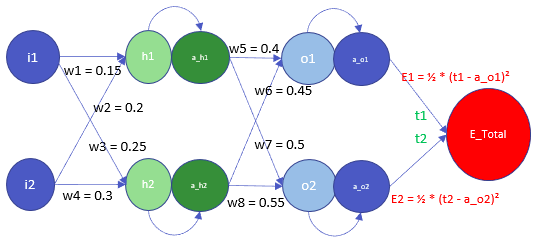
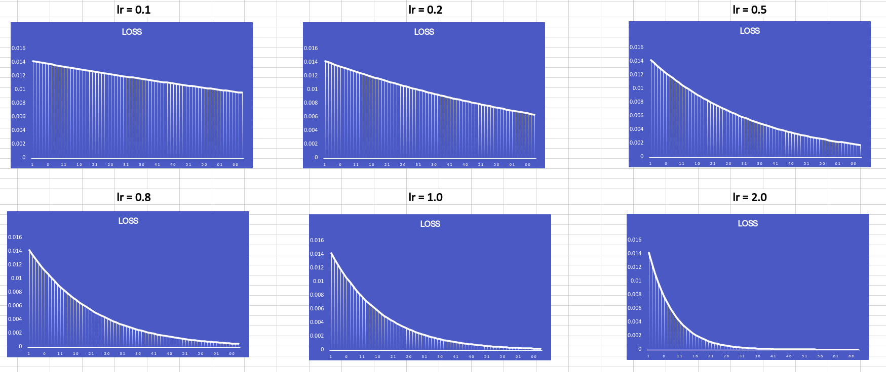
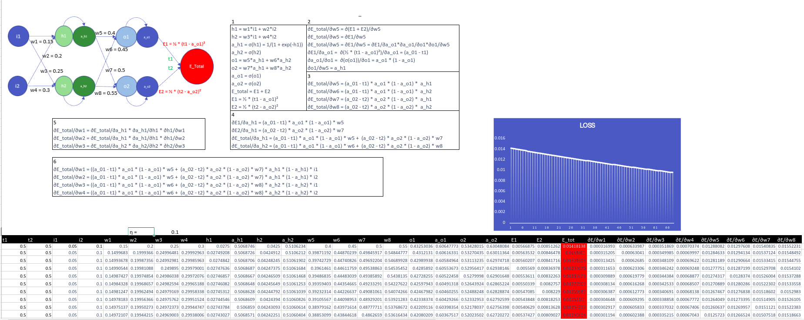

# Submission for Week 5

- [Problem Statement](#Problem-Statement)
- [What is backpropagation](#What-is-backpropagation)
- [The Architecture](#The-Architecture)
- [Introduction to the Problem ](#Introduction-to-the-Problem )
- [Basic Explanation](#Basic-Explanation)
- [Backpropagation](#Backpropagation)
  * [PART-1](#PART-1)
  * [PART-2](#PART-2)
- [Experimentation](#Experimentation)
- [Sample Work](#Sample-Work)
- [Conclusion](#Conclusion)
# Problem Statement

Train a Neural Network using Excel for doing backpropagation

consider using learning rate  [0.1, 0.2, 0.5, 0.8, 1.0, 2.0] and make a comparison in learning

# What is backpropagation

A Simple explanation of the backpropagation is adjusting values of weights based on the calculated error

# The Architecture

# Introduction to the Problem

|_| Description|
|-|-|
| i1,i2 | Input to the neural network |
| o1,o2 | Output of neural network |
| a_h1,a_h2,a_o1,a_o2 | Values after applying activation function |

# For better understanding and easy calculation we are already taking defined values of weights

|weight| value|
|-|-|
| w1 | 0.15 |
| w2 | 0.2|
| w3 | 0.25|
| w4 | 0.3 |
| w5 | 0.4 |
| w6 | 0.45 |
| w7 | 0.5|
| w8 | 0.55 |

# Basic Explanation

Considering we make a forward pass and get the values of weights and loss, we now need to understand what exactly is happening in the network for updating weights value with the help of the learning rate

To perform backpropagation and training of the neural network let us first understand some basic calculations for the architecture

**As we can see h1 is connected with i1 and i2 so the calculation for h1 is simple**

$$
h1 = w1 \cdot i1 + w2 \cdot i2
$$

**For h2 the same logic as h1 is applicable where we use i1 and i2**

$$
h2 = w3 \cdot i1 + w4 \cdot i2
$$

**For activation instead of using activation functions available in PyTorch we will be using**

**which represents the sigmoid activation function, so in the below formula we just apply sigmoid on the value of h1 and call a_h1**

$$
a_{h1} = \sigma(h1) = \frac{1}{1 + \exp(-h1)}
$$

**We perform the same thing for h2 as well and call it a_h2**

$$
a_{h2} = \sigma(h2) = \frac{1}{1 + \exp(-h1)}
$$

**Now o_1 and o_2 represent our outputs from the neural net, so to calculate o_1 we use a_h1 and a_h2 with weights and the calculation is pretty same as calculating h1 and h2 value**

$$
o1 = w5 \cdot a_{h1} + w6 \cdot a_{h2}
$$

**For calculating o_2 we perform the same operation as 0_1 but with different weights**

$$
o2 = w7 \cdot a_{h1} + w8 \cdot a_{h2}
$$

**Now we have our output value from the neural network, so we apply sigmoid again and get the final output**

$$
a_{o1} = \sigma(o1)
$$

$$
a_{o2} = \sigma(o2)
$$

**Next, The error for each output neuron (a_o1 and a_o2) is calculated using the squared error function and sum them up to get the total error (E_total)**

**Calculating the Error (Loss) [Note:  1/2 is included so that the exponent is canceled when we differentiate the error term.]**

$$
E_{total} = E1 + E2
$$

$$
E1 = \frac{1}{2} \cdot (t1 - a_{o1})^2
$$

$$
E2 = \frac{1}{2} \cdot (t2 - a_{o2})^2
$$

# Backpropagation

**Let's jump to the slightly harder part of the solution with is backpropagating**

**We will be writing the basic part of the equation first to understand the components, and then the actual equation**

#### Let's divide this beautiful math part into two steps, one is where go deep and solve it for w5,w6,w7, and w8, and the second step is where we do it for w1,w2,w3, and w4

## PART-1

**We can understand that once we try to calculate the partial derivative of E_total with respect to w5, we need to go through the partial derivative of E1 + E2 with respect to w5**

$$
\frac{\partial E_{\text{total}}}{\partial w_5} = \frac{\partial (E_1 + E_2)}{\partial w_5}
$$

**Now E2 is constant for us so we only use E1 to calculate it**

$$
\frac{\partial E_{\text{total}}}{\partial w_5} = \frac{\partial E_1}{\partial w_5}
$$

**Now For getting the partial derivative for E1 with respect to w5 we need to use the chain rule because they are not connected directly, in this case, we gonna first calculate**

$$
\frac{\partial E_{\text{total}}}{\partial w_5} = \frac{\partial E_1}{\partial w_5} = \frac{\partial E_1}{\partial a_{o1}} \cdot \frac{\partial a_{o1}}{\partial o1} \cdot \frac{\partial o1}{\partial w_5}
$$

**Now we can breakdown this into Three steps**

##### **First step**

$$
\frac{\partial E_1}{\partial a_{o1}}
$$

**Now we focus on value of E1 from [Basic Explanation](#Basic-Explanation) just to breakdown even more**
***The a_o1 - t1 comes in the final output because of the basic formula of derivative where we first breakdown 1/2*(t_1-a_o1)^2 and get t1-a_o1 and then a_o1-t1***

$$
\frac{\partial E_1}{\partial a_{o1}} = \frac{\partial \left(\frac{1}{2} \cdot (t1 - a_{o1})^2\right)}{\partial a_{o1}} = (a_{o1} - t1)
$$

##### **Second Step**

$$
\frac{\partial a_{o1}}{\partial o1}
$$

**And when we add the formula for a_01 from [Basic Explanation](#Basic-Explanation) we get**

$$
\frac{\partial a_{o1}}{\partial o1} = \frac{\partial (\sigma(o1))}{\partial o1} = a_{o1} \cdot (1 - a_{o1})
$$

***Here is a beautiful explanation of how we can breakdown the sigmoid derivative so please check it out [TowardsDataScience Article](https://towardsdatascience.com/derivative-of-the-sigmoid-function-536880cf918e)***

##### **Third Step**

$$
\frac{\partial o1}{\partial w_5}
$$

**which is equal to**

$$
\frac{\partial o1}{\partial w_5} = a_{h1}
$$

**Now we sum up all together**

$$
\frac{\partial E_{\text{total}}}{\partial w5} = (a_{01} - t1) \cdot a_{o1} \cdot (1 - a_{o1}) \cdot a_{h1}
$$

#### In the same way we will also perform the calculation for

$$
\frac{\partial E_{\text{total}}}{\partial w6} = (a_{01} - t1) \cdot a_{o1} \cdot (1 - a_{o1}) \cdot a_{h2}
$$

$$
\frac{\partial E_{\text{total}}}{\partial w7} = (a_{02} - t2) \cdot a_{o2} \cdot (1 - a_{o2}) \cdot a_{h1}
$$

$$
\frac{\partial E_{\text{total}}}{\partial w8} = (a_{02} - t2) \cdot a_{o2} \cdot (1 - a_{o2}) \cdot a_{h2}
$$

## PART-2

### Now we take one more step ahead and calculate E_total with respect to w1,w2,w3 and w4

#### Let's first understand the basic breakdown before the complex equation

##### So first we try to understand how we can go for getting d(E_total)/d(w1) in this case we need to use both a_h1 and a_h2 for calculation so let's go with a_h1 first

**And the below equation is just following the normal chain rule**

$$
\frac{\partial E1}{\partial a_{h1}} = \frac{\partial E1}{\partial a_{o1}} \cdot \frac{\partial a_{o1}}{\partial o_1} \cdot  \frac{\partial o_1}{\partial a_{h1}}
$$

**Now from the previous calculation we try to fill in these values, and we get**

$$
\frac{\partial E1}{\partial a_{h1}} = (a_{01} - t1) \cdot a_{o1} \cdot (1 - a_{o1}) \cdot w5
$$

##### Now we can go ahead and write it for d(E2)/d(a_h1) and later for E_total as well with respect to a_h1 and a_h2

$$
\frac{\partial E2}{\partial a_{h1}} = (a_{02} - t2) \cdot a_{o2} \cdot (1 - a_{o2}) \cdot w7
$$

$$
\frac{\partial E_{\text{total}}}{\partial a_{h1}} = (a_{01} - t1) \cdot a_{o1} \cdot (1 - a_{o1}) \cdot w5 + (a_{02} - t2) \cdot a_{o2} \cdot (1 - a_{o2}) \cdot w7
$$

$$
\frac{\partial E_{\text{total}}}{\partial a_{h2}} = (a_{01} - t1) \cdot a_{o1} \cdot (1 - a_{o1}) \cdot w6 + (a_{02} - t2) \cdot a_{o2} \cdot (1 - a_{o2}) \cdot w8
$$

#### And when we try to breakdown the problem in simple steps of chain rule we get this

$$
\frac{\partial E_{\text{total}}}{\partial w1} = \frac{\partial E_{\text{total}}}{\partial a_{h1}} \cdot \frac{\partial a_{h1}}{\partial h1} \cdot \frac{\partial h1}{\partial w1}
$$

$$
\frac{\partial E_{\text{total}}}{\partial w2} = \frac{\partial E_{\text{total}}}{\partial a_{h1}} \cdot \frac{\partial a_{h1}}{\partial h1} \cdot \frac{\partial h1}{\partial w2}
$$

$$
\frac{\partial E_{\text{total}}}{\partial w3} = \frac{\partial E_{\text{total}}}{\partial a_{h2}} \cdot \frac{\partial a_{h2}}{\partial h2} \cdot \frac{\partial h2}{\partial w3}
$$

#### Let's put it all together

$$
\frac{\partial E_{\text{total}}}{\partial w1} = \left((a_{01} - t1) \cdot a_{o1} \cdot (1 - a_{o1}) \cdot w5 + (a_{02} - t2) \cdot a_{o2} \cdot (1 - a_{o2}) \cdot w7\right) \cdot a_{h1} \cdot (1 - a_{h1}) \cdot i1
$$

$$
\frac{\partial E_{\text{total}}}{\partial w2} = \left((a_{01} - t1) \cdot a_{o1} \cdot (1 - a_{o1}) \cdot w5 + (a_{02} - t2) \cdot a_{o2} \cdot (1 - a_{o2}) \cdot w7\right) \cdot a_{h1} \cdot (1 - a_{h1}) \cdot i2
$$

$$
\frac{\partial E_{\text{total}}}{\partial w3} = \left((a_{01} - t1) \cdot a_{o1} \cdot (1 - a_{o1}) \cdot w6 + (a_{02} - t2) \cdot a_{o2} \cdot (1 - a_{o2}) \cdot w8\right) \cdot a_{h2} \cdot (1 - a_{h2}) \cdot i1
$$

$$
\frac{\partial E_{\text{total}}}{\partial w4} = \left((a_{01} - t1) \cdot a_{o1} \cdot (1 - a_{o1}) \cdot w6 + (a_{02} - t2) \cdot a_{o2} \cdot (1 - a_{o2}) \cdot w8\right) \cdot a_{h2} \cdot (1 - a_{h2}) \cdot i2
$$

# Now we go ahead and update our weights according to all these values that we have created and for that the formula is simple

$$
W_{\text{t+1}}=W_{\text{t}}-LearningRate*GRADIENTS
$$

here in the formula

   W_t+1 -> Value of weight after backpropagation
   W_t -> Current value of weight
   gradients -> Derivative of loss with respect to a particular weight

# Experimentation

In the excel file the learning rate is represented as η 

Once we run it with different learning rates as mentioned above we get these curves to understand the major role of the learning rate, which can be seen in these graphs

# Sample Work

# Conclusion 

The small learning rate takes a lot of time to find the optimum minimum value and the large learning rate takes a lot of jumps and gets stuck to find the minimum value. So, we should choose a moderate value for the learning rate

