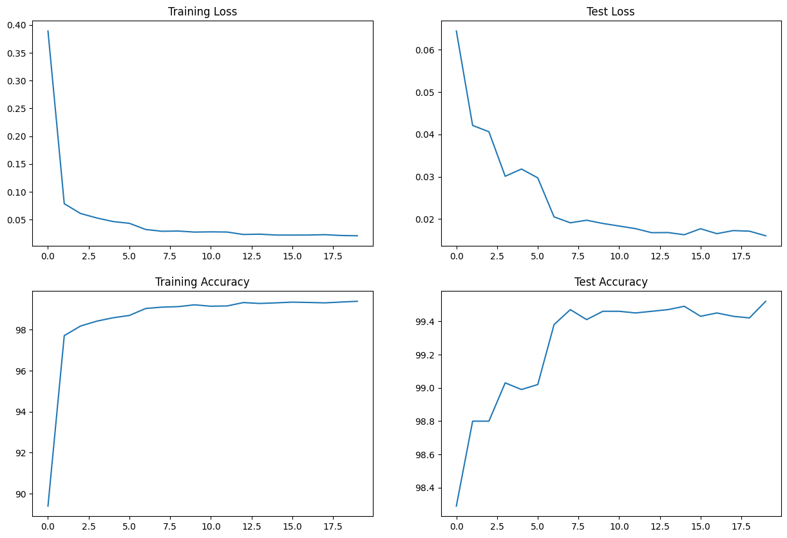
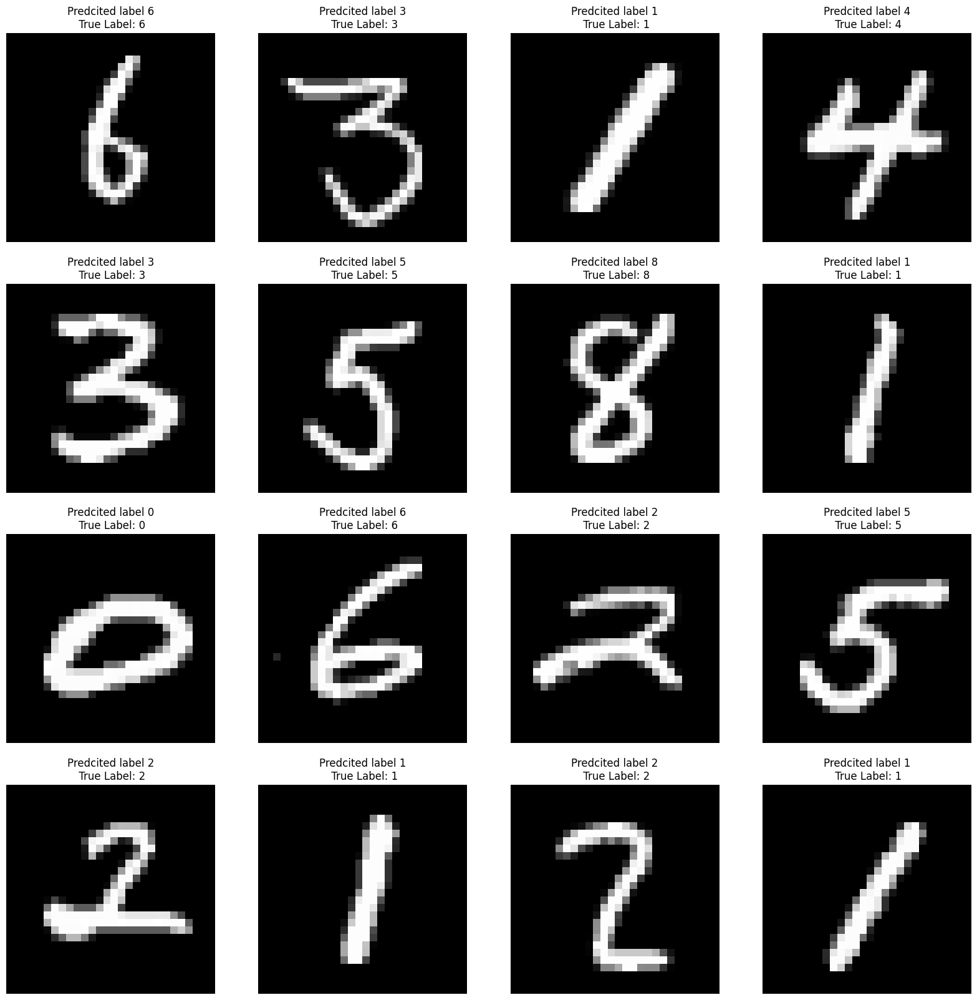
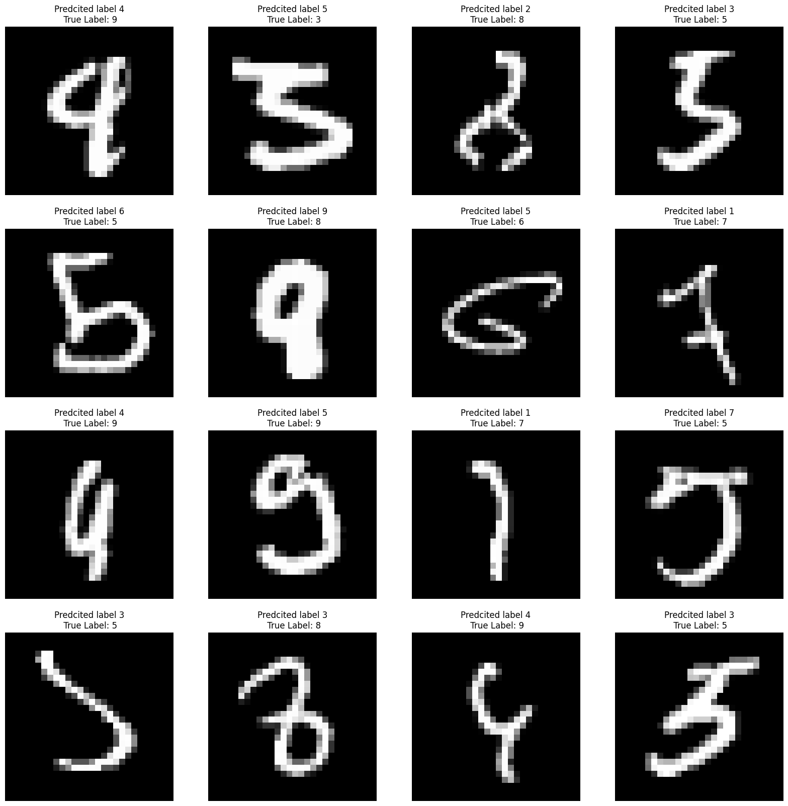
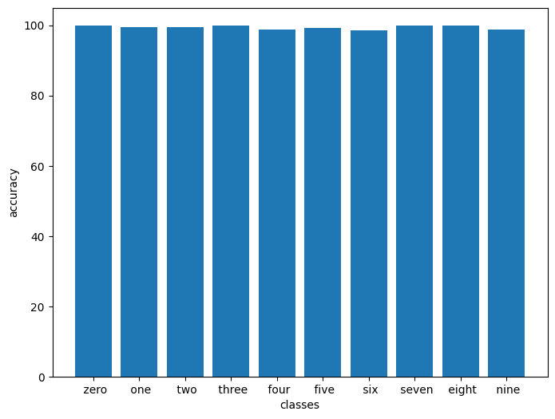

# Submission for Session6 

- [Problem Statement](#Problem-Statement)
- [File Structure](#File-Structure)
- [Model Parameters](#Model-Parameters)
- [Results](#Results)
  * [Accuracy Plot](#Accuracy-Plot)
  * [Sample Output](#Sample-Output)
  * [Misclassified Images](#Misclassified-Images)
  * [Accuracy Report for Each class](#Accuracy-Report-for-Each-class)
- [Learnings from the work](#Learnings-from-the-work)

# File Structure

* model.py
  * Contains Model Architecture
* utils.py
  * Contains all the functions which are required to initiate the training
    * Contains data augmentation
    * Test and Train functions
    * Plotting Misclassified results and random prediction code
    * Contains code for plotting the accuracy and loss plot on test and train set
* S5.ipynb
  * contains execution of imports from these files
  * One file which compiles down all the code required for training
* logs/
  * collects logs from each and every file
  * mainly used for collecting loss and accuracy during training
* .gitignore
  * For not pushing the unnecessary things available in code folder

# Problem Statement

### Training CNN for MNIST dataset

1. 99.4% validation accuracy
2. Less than 20k Parameters
3. You can use anything from above you want.
4. Less than 20 Epochs
5. Have used BN, Dropout,
6. (Optional): a Fully connected layer, have used GAP.

# Model Parameters

* Here is the quick information regarding the model :
  * There are 9,404 total parameters used in the model

---------------------------------------------------------------

         Layer (type)               Output Shape         Param #
---------------------------------------------------------------

            Conv2d-1            [-1, 4, 26, 26]              36
       BatchNorm2d-2            [-1, 4, 26, 26]               8
              ReLU-3            [-1, 4, 26, 26]               0
           Dropout-4            [-1, 4, 26, 26]               0
            Conv2d-5            [-1, 8, 24, 24]             288
       BatchNorm2d-6            [-1, 8, 24, 24]              16
              ReLU-7            [-1, 8, 24, 24]               0
           Dropout-8            [-1, 8, 24, 24]               0
            Conv2d-9           [-1, 12, 22, 22]             864
      BatchNorm2d-10           [-1, 12, 22, 22]              24
             ReLU-11           [-1, 12, 22, 22]               0
          Dropout-12           [-1, 12, 22, 22]               0
           Conv2d-13           [-1, 16, 20, 20]           1,728
      BatchNorm2d-14           [-1, 16, 20, 20]              32
             ReLU-15           [-1, 16, 20, 20]               0
          Dropout-16           [-1, 16, 20, 20]               0
        MaxPool2d-17           [-1, 16, 10, 10]               0
           Conv2d-18           [-1, 12, 10, 10]             192
      BatchNorm2d-19           [-1, 12, 10, 10]              24
             ReLU-20           [-1, 12, 10, 10]               0
           Conv2d-21            [-1, 8, 10, 10]              96
      BatchNorm2d-22            [-1, 8, 10, 10]              16
             ReLU-23            [-1, 8, 10, 10]               0
           Conv2d-24             [-1, 12, 8, 8]             864
      BatchNorm2d-25             [-1, 12, 8, 8]              24
             ReLU-26             [-1, 12, 8, 8]               0
          Dropout-27             [-1, 12, 8, 8]               0
           Conv2d-28             [-1, 16, 6, 6]           1,728
      BatchNorm2d-29             [-1, 16, 6, 6]              32
             ReLU-30             [-1, 16, 6, 6]               0
          Dropout-31             [-1, 16, 6, 6]               0
           Conv2d-32             [-1, 20, 4, 4]           2,880
      BatchNorm2d-33             [-1, 20, 4, 4]              40
             ReLU-34             [-1, 20, 4, 4]               0
           Conv2d-35             [-1, 16, 4, 4]             320
      BatchNorm2d-36             [-1, 16, 4, 4]              32
             ReLU-37             [-1, 16, 4, 4]               0
        AvgPool2d-38             [-1, 16, 1, 1]               0
           Conv2d-39             [-1, 10, 1, 1]             160
---------------------------------------------------------------

    Total params: 9,404
    Trainable params: 9,404
    Non-trainable params: 0
---------------------------------------------------------------

    Input size (MB): 0.00
    Forward/backward pass size (MB): 0.71
    Params size (MB): 0.04
    Estimated Total Size (MB): 0.75
---------------------------------------------------------------

# Training Logs

    Adjusting learning rate of group 0 to 1.0000e-02.
    Epoch 1
    Train: Loss=0.0264 Batch_id=937 Accuracy=89.40: 100%|██████████| 938/938 [00:53<00:00, 17.54it/s]
    Test set: Average loss: 0.0644, Accuracy: 9829/10000 (98.29%)

    Adjusting learning rate of group 0 to 1.0000e-02.
    Epoch 2
    Train: Loss=0.0704 Batch_id=937 Accuracy=97.71: 100%|██████████| 938/938 [00:51<00:00, 18.10it/s]
    Test set: Average loss: 0.0421, Accuracy: 9880/10000 (98.80%)

    Adjusting learning rate of group 0 to 1.0000e-02.
    Epoch 3
    Train: Loss=0.0167 Batch_id=937 Accuracy=98.18: 100%|██████████| 938/938 [00:51<00:00, 18.33it/s]
    Test set: Average loss: 0.0406, Accuracy: 9880/10000 (98.80%)

    Adjusting learning rate of group 0 to 1.0000e-02.
    Epoch 4
    Train: Loss=0.0516 Batch_id=937 Accuracy=98.42: 100%|██████████| 938/938 [00:51<00:00, 18.21it/s]
    Test set: Average loss: 0.0301, Accuracy: 9903/10000 (99.03%)

    Adjusting learning rate of group 0 to 1.0000e-02.
    Epoch 5
    Train: Loss=0.0046 Batch_id=937 Accuracy=98.58: 100%|██████████| 938/938 [00:51<00:00, 18.32it/s]
    Test set: Average loss: 0.0318, Accuracy: 9899/10000 (98.99%)

    Adjusting learning rate of group 0 to 1.0000e-02.
    Epoch 6
    Train: Loss=0.0525 Batch_id=937 Accuracy=98.70: 100%|██████████| 938/938 [00:50<00:00, 18.48it/s]
    Test set: Average loss: 0.0297, Accuracy: 9902/10000 (99.02%)

    Adjusting learning rate of group 0 to 3.0000e-03.
    Epoch 7
    Train: Loss=0.0153 Batch_id=937 Accuracy=99.04: 100%|██████████| 938/938 [00:50<00:00, 18.50it/s]
    Test set: Average loss: 0.0205, Accuracy: 9938/10000 (99.38%)

    Adjusting learning rate of group 0 to 3.0000e-03.
    Epoch 8
    Train: Loss=0.0036 Batch_id=937 Accuracy=99.10: 100%|██████████| 938/938 [00:51<00:00, 18.39it/s]
    Test set: Average loss: 0.0191, Accuracy: 9947/10000 (99.47%)

    Adjusting learning rate of group 0 to 3.0000e-03.
    Epoch 9
    Train: Loss=0.0207 Batch_id=937 Accuracy=99.13: 100%|██████████| 938/938 [00:51<00:00, 18.24it/s]
    Test set: Average loss: 0.0197, Accuracy: 9941/10000 (99.41%)

    Adjusting learning rate of group 0 to 3.0000e-03.
    Epoch 10
    Train: Loss=0.0012 Batch_id=937 Accuracy=99.22: 100%|██████████| 938/938 [00:51<00:00, 18.28it/s]
    Test set: Average loss: 0.0190, Accuracy: 9946/10000 (99.46%)

    Adjusting learning rate of group 0 to 3.0000e-03.
    Epoch 11
    Train: Loss=0.0283 Batch_id=937 Accuracy=99.15: 100%|██████████| 938/938 [00:51<00:00, 18.27it/s]
    Test set: Average loss: 0.0183, Accuracy: 9946/10000 (99.46%)

    Adjusting learning rate of group 0 to 3.0000e-03.
    Epoch 12
    Train: Loss=0.0102 Batch_id=937 Accuracy=99.16: 100%|██████████| 938/938 [00:51<00:00, 18.11it/s]
    Test set: Average loss: 0.0177, Accuracy: 9945/10000 (99.45%)

    Adjusting learning rate of group 0 to 9.0000e-04.
    Epoch 13
    Train: Loss=0.0013 Batch_id=937 Accuracy=99.33: 100%|██████████| 938/938 [00:51<00:00, 18.39it/s]
    Test set: Average loss: 0.0168, Accuracy: 9946/10000 (99.46%)

    Adjusting learning rate of group 0 to 9.0000e-04.
    Epoch 14
    Train: Loss=0.1488 Batch_id=937 Accuracy=99.28: 100%|██████████| 938/938 [00:50<00:00, 18.47it/s]
    Test set: Average loss: 0.0168, Accuracy: 9947/10000 (99.47%)

    Adjusting learning rate of group 0 to 9.0000e-04.
    Epoch 15
    Train: Loss=0.0021 Batch_id=937 Accuracy=99.31: 100%|██████████| 938/938 [00:51<00:00, 18.26it/s]
    Test set: Average loss: 0.0163, Accuracy: 9949/10000 (99.49%)

    Adjusting learning rate of group 0 to 9.0000e-04.
    Epoch 16
    Train: Loss=0.0356 Batch_id=937 Accuracy=99.34: 100%|██████████| 938/938 [00:50<00:00, 18.47it/s]
    Test set: Average loss: 0.0177, Accuracy: 9943/10000 (99.43%)

    Adjusting learning rate of group 0 to 9.0000e-04.
    Epoch 17
    Train: Loss=0.0163 Batch_id=937 Accuracy=99.33: 100%|██████████| 938/938 [00:51<00:00, 18.27it/s]
    Test set: Average loss: 0.0165, Accuracy: 9945/10000 (99.45%)

    Adjusting learning rate of group 0 to 9.0000e-04.
    Epoch 18
    Train: Loss=0.0017 Batch_id=937 Accuracy=99.31: 100%|██████████| 938/938 [00:51<00:00, 18.13it/s]
    Test set: Average loss: 0.0173, Accuracy: 9943/10000 (99.43%)

    Adjusting learning rate of group 0 to 2.7000e-04.
    Epoch 19
    Train: Loss=0.0515 Batch_id=937 Accuracy=99.35: 100%|██████████| 938/938 [00:50<00:00, 18.47it/s]
    Test set: Average loss: 0.0171, Accuracy: 9942/10000 (99.42%)

    Adjusting learning rate of group 0 to 2.7000e-04.
    Epoch 20
    Train: Loss=0.0047 Batch_id=937 Accuracy=99.39: 100%|██████████| 938/938 [00:50<00:00, 18.53it/s]
    Test set: Average loss: 0.0160, Accuracy: 9952/10000 (99.52%)

    Adjusting learning rate of group 0 to 2.7000e-04.

# Results

## Accuracy Plot

Here is the Accuracy and Loss metric plot for the model

## Sample Output

Here is the sample result of model classification

## Misclassified Images

Here is the sample result of model miss-classified images

## Accuracy Report for Each class

    Accuracy of 0 - zero : 100 %
    Accuracy of 1 - one : 99 %
    Accuracy of 2 - two : 99 %
    Accuracy of 3 - three : 100 %
    Accuracy of 4 - four : 98 %
    Accuracy of 5 - five : 99 %
    Accuracy of 6 - six : 98 %
    Accuracy of 7 - seven : 100 %
    Accuracy of 8 - eight : 100 %
    Accuracy of 9 - nine : 98 %

# Learnings from the work 

* Receptive field does not depend on number of parameters 
* If we avoid using linear layers we can reduce the parameters very easily
* We can use global average pooling layer insted of linear or fully connected layer in the network, with fully connected layer we loose spartial information of image, on the other hand global average pooling layer takes average of feature map which keeps the spatial information and also does not increse the number of parameters, so win win situation
* We should use dropout in the cases of overfitting to introduce regularization along with batchNormalization, this makes network to learn more without getting overfit 
* After a while the accuracy freezes and seems like the network is not learning any more, in these kind of situations we need to reduce the learning rate of network, so we can use learning rate schedulers to get the job done
* Not every type of normalization and learning rate schedulers can work out for a particular use case, so it is better to experiment on available options and get the best out of it 
* Hyperparmeters plays a important role in learning, we should keep playing with that to know how model is training on the dataset, just by changing and playing around with few hyperparameters we can crack on which exact epoch we need to change learning rate, with what ratio and how often 
