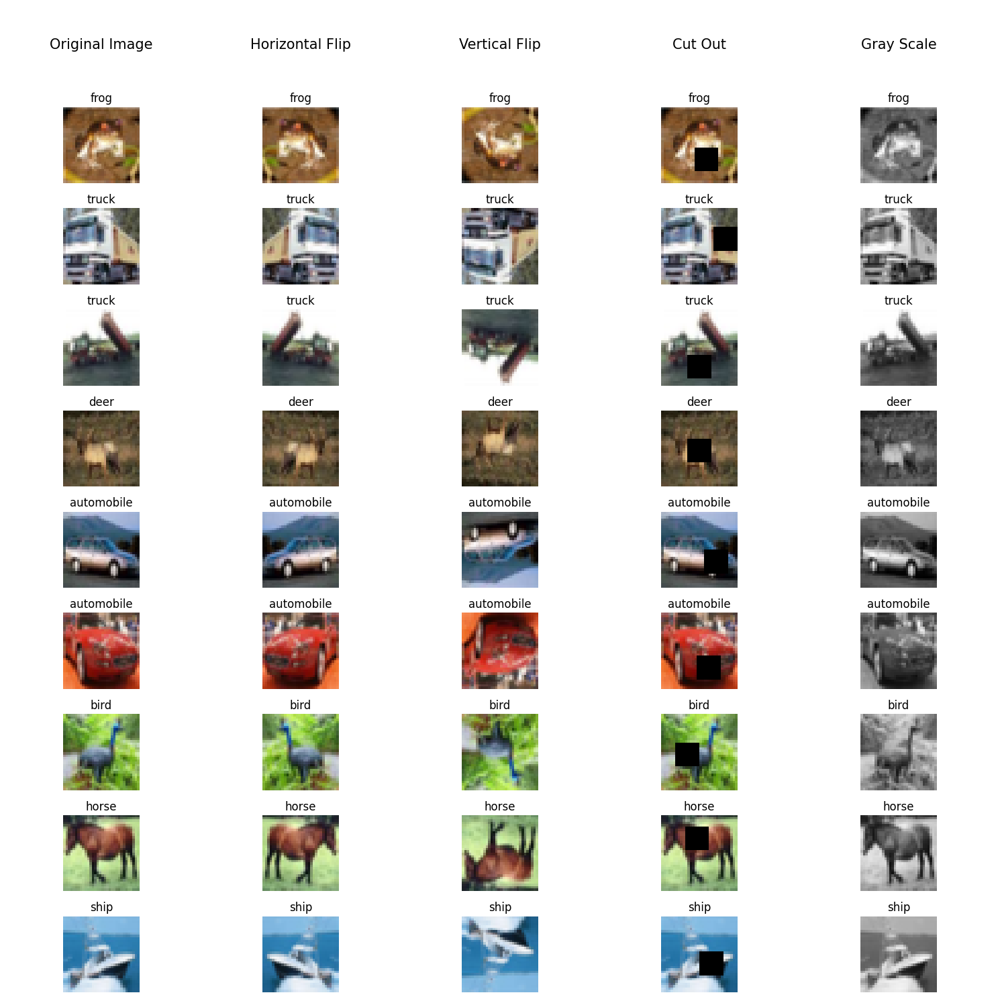
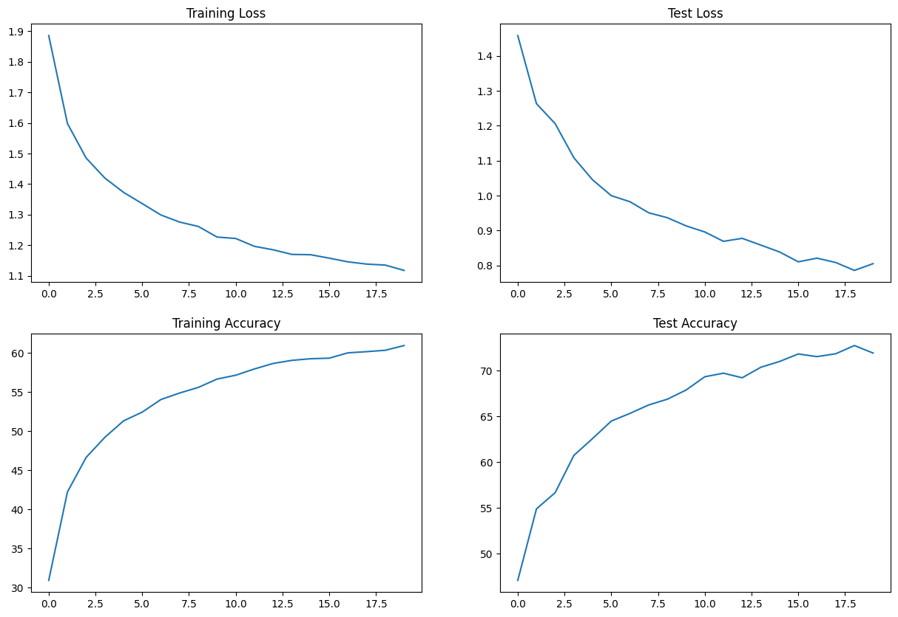
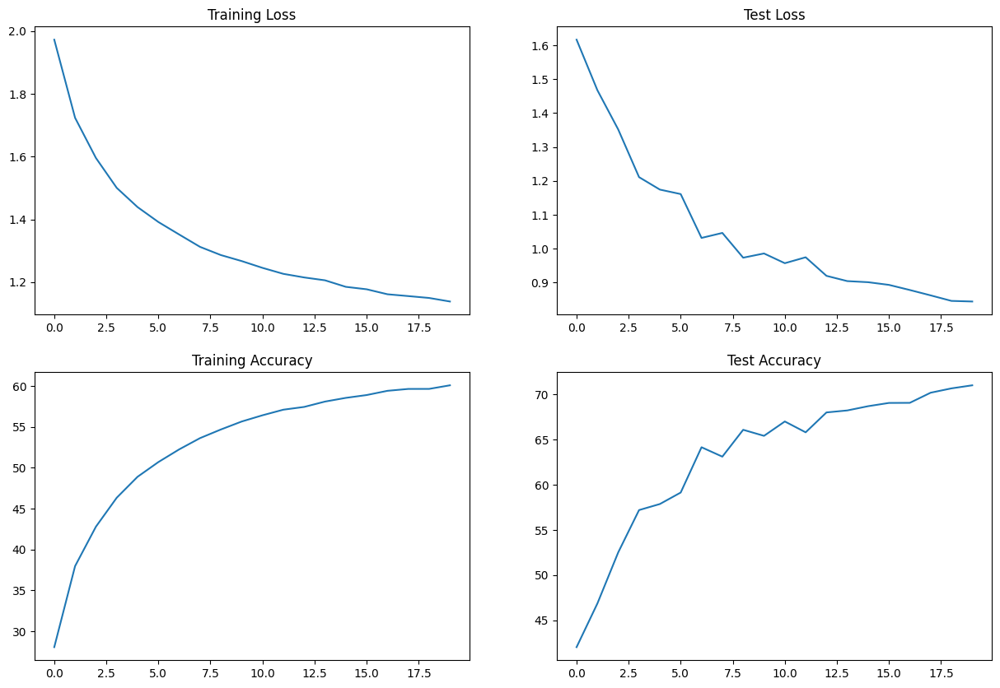
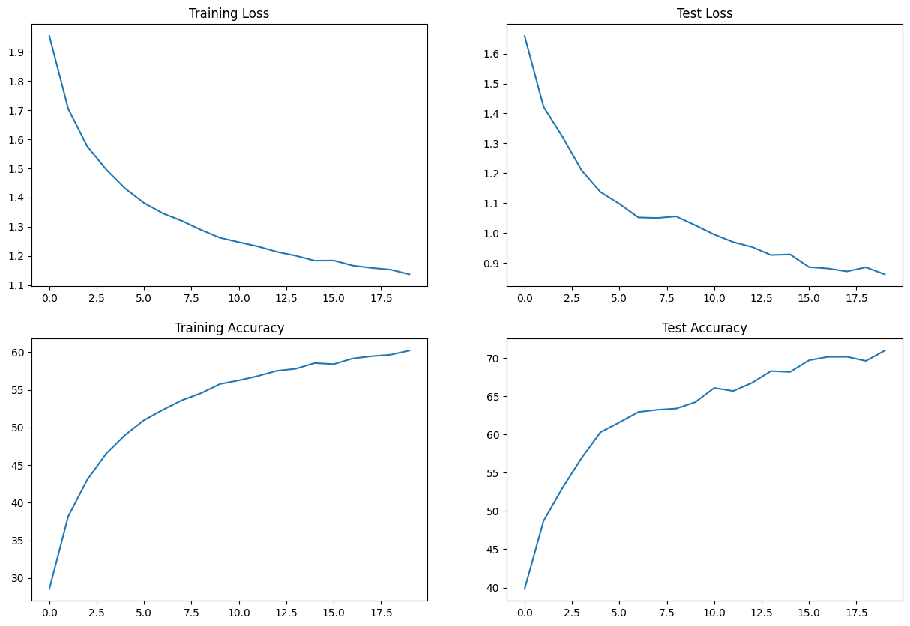
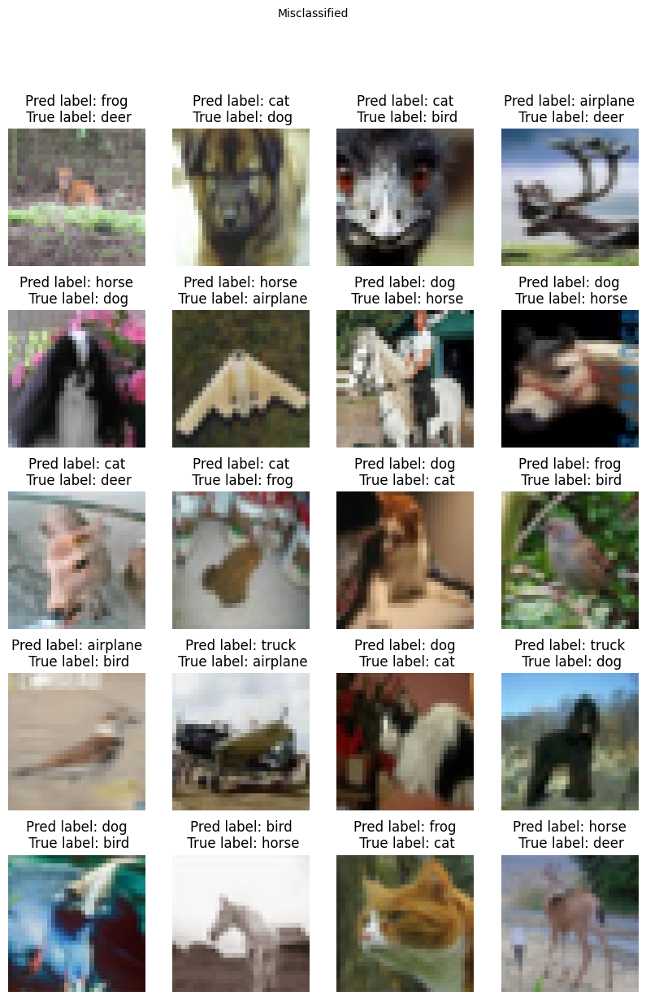
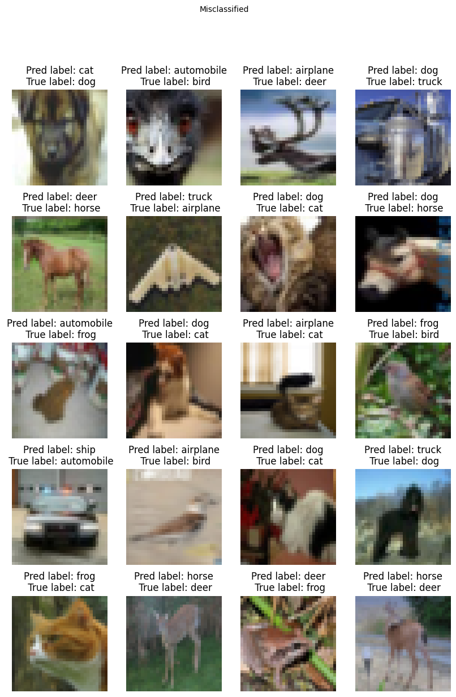
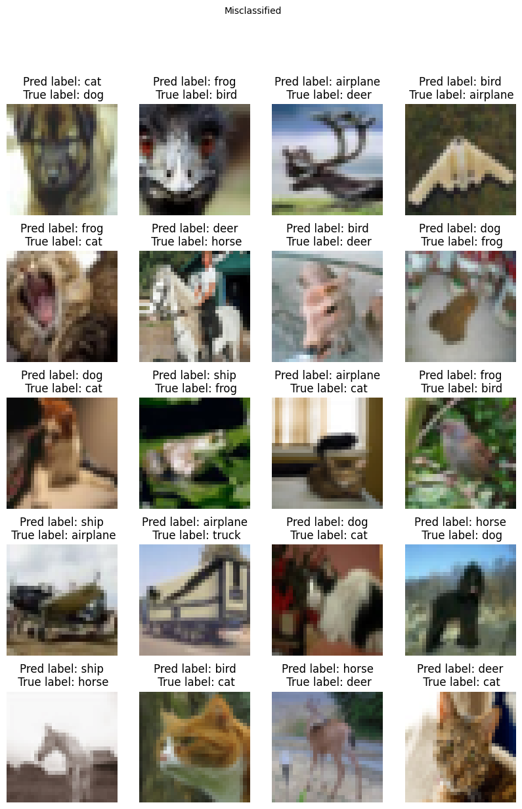

# Submission for Week 5

- [Problem Statement](#Problem-Statement)
- [File Structure](#File-Structure)
- [Findings on Normalization](#Findings-on-Normalization)
- [Normalization Maths](#Normalization-Maths)
- [Applied Augmentation](#Applied-Augmentation)
- [Model Parameters](#Model-Parameters)
- [Results](#Results)
  * [Accuracy Plots](#Accuracy-Plots)
  * [Misclassified Images](#Misclassified-Images)
  * [Accuracy Report for Each class](#Accuracy-Report-for-Each-class)
- [Other Experiments](#Other-Experiments)

# Problem Statement

### Training CNN for CIFAR Dataset

1. keep the parameter count less than 50,000
2. Use Batch-Norm, Layer-Norm, and Group-Norm and create post the results
3. Max Epochs is 20

# File Structure

* other_experiments
  * Contains Execution of different model architectures during this experiment
* src
  * Contains all the code required during training in different modules
    * dataset.py -> contains code related to dataset loading and augmentation
    * model.py -> Contains the model architecture
    * test.py -> contains code for running model on test set
    * train.py -> contains training loop
    * uitls.py -> contains functions for plotting and extra supportive functions for code
* S8_BN.ipynb
  * contains the execution of code with batch-normalization
* S8_LN.ipynb
  * contains the execution of code with layer-normalization
* S8_GN.ipynb
  * contains the execution of code with group-normalization

# Findings on Normalization

|      Normalization type      |                          Overall Working                          |                                                                                                           Observations during experiment                                                                                                           |  |
| :---------------------------: | :----------------------------------------------------------------: | :-------------------------------------------------------------------------------------------------------------------------------------------------------------------------------------------------------------------------------------------------: | :-: |
| **Group Normalization** |         Takes Group of channels and normalizes each group        | Group size plays an important role here, first of all, we can not define a group size that is not divisible by our channel size, also an optimal group size is required, the experiment was done on both 4 and 2 group size 2 seems to be better in results and also does not differ the model architecture with other two normalizations |  |
| **Layer Normalization** |          Normalizes all the activation of single layers.          |                                     This is slightly tricky, we need to use group normalization with a group size of 1 to call it layer normalization, it is slightly better than group normalization in terms of running and accuracy at least for this experiment                                     |  |
| **Batch Normalization** | Normalizes the layers input rescaling and re-centering the images. |                                                                                                 No questions, it is the best, dropout values play an important role here                                                                                               |  |

# Normalization Maths

[Checkout Excel file for details and experiments](https://github.com/deepanshudashora/ERAV1/blob/master/session8/other_experiments/Normalizations.xlsx)

    

# Applied Augmentation

    

# [Model Parameters](https://github.com/deepanshudashora/ERAV1/blob/master/session8/src/model.py)

    Total params: 19,702
    Trainable params: 19,702
    Non-trainable params: 0

# Performace Comparision

| Normalization Type  | Parameters | Best Training Accuracy | Best Testing Accuracy |
| ------------------- | ---------- | ---------------------- | --------------------- |
| [Batch Normalization](https://github.com/deepanshudashora/ERAV1/blob/master/session8/S8_BN.ipynb) | 19,702     | 60.94%                 | 72.73%                |
| [Layer Normalization](https://github.com/deepanshudashora/ERAV1/blob/master/session8/S8_LN.ipynb) | 19,702     | 60.22%                 | 70.96%                |
| [Group Normalization](https://github.com/deepanshudashora/ERAV1/blob/master/session8/S8_GN.ipynb) | 19,702     | 60.09%                 | 71.00%                |

# Results

## Accuracy Plots

| Batch Normalization   | Group Normalization   | Layer Normalization   |
| --------------------- | --------------------- | --------------------- |
|  |  |  |

## Misclassified Images

### For Batch Normalization

    

### For Group Normalization

    

### For Layer Normalization

    

## Accuracy Report for Each class

| Class Name | Batch Normalization (in %) | Group Normalization (in %) | Layer Normalization (in %) |
| ---------- | -------------------------- | -------------------------- | -------------------------- |
| airplane   | 71                         | 77                         | 80                         |
| automobile | 93                         | 88                         | 91                         |
| bird       | 48                         | 45                         | 61                         |
| cat        | 51                         | 51                         | 39                         |
| deer       | 68                         | 73                         | 68                         |
| dog        | 61                         | 66                         | 60                         |
| frog       | 85                         | 72                         | 80                         |
| horse      | 79                         | 79                         | 77                         |
| ship       | 79                         | 78                         | 85                         |
| truck      | 80                         | 85                         | 75                         |

# [Other Experiments](https://github.com/deepanshudashora/ERAV1/tree/master/session8/other_experiments)

Please checkout other experiments with model parameters [42000](https://github.com/deepanshudashora/ERAV1/tree/master/session8/other_experiments/42000), [29000](https://github.com/deepanshudashora/ERAV1/tree/master/session8/other_experiments/29000), [27000](https://github.com/deepanshudashora/ERAV1/tree/master/session8/other_experiments/27000), [21000](https://github.com/deepanshudashora/ERAV1/tree/master/session8/other_experiments/21000)
