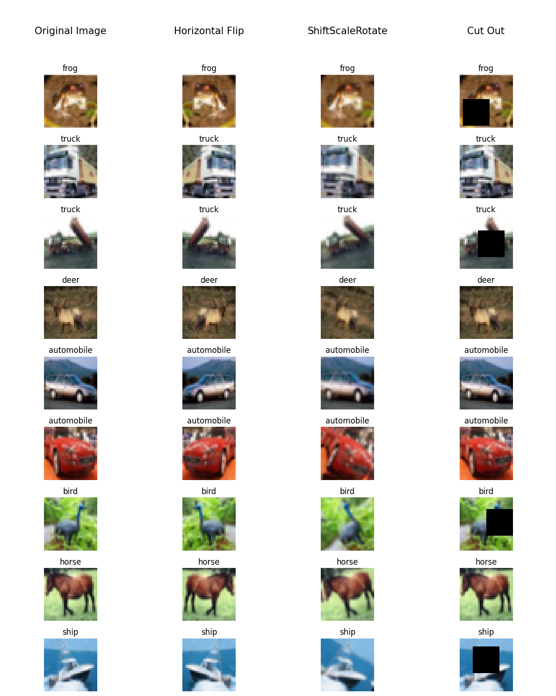
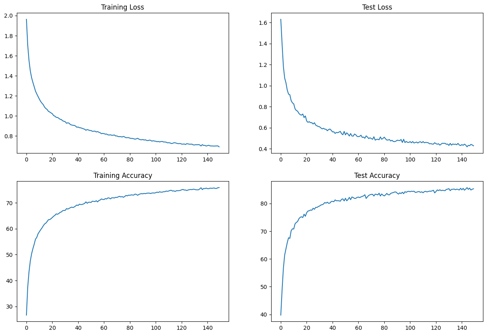
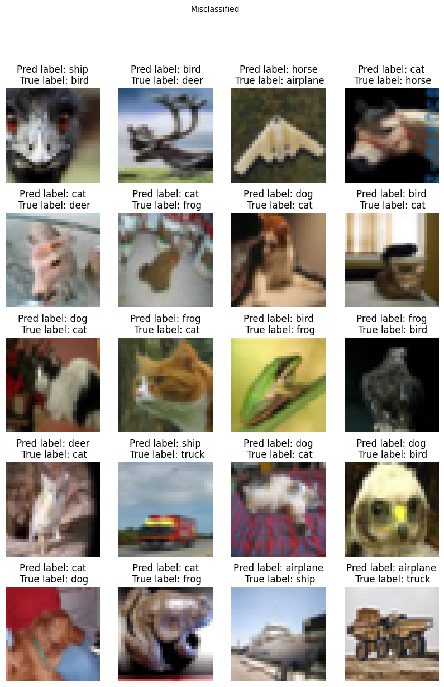
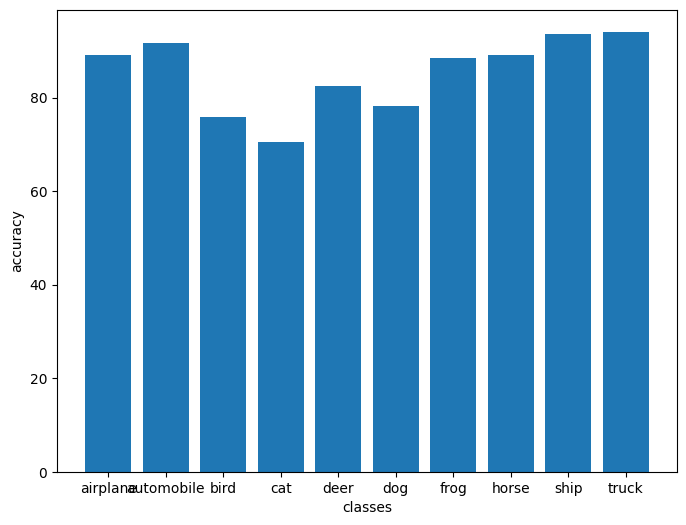

# Submission for Week 5

- [Problem Statement](#Problem-Statement)
- [File Structure](#File-Structure)
- [Applied Augmentation](#Applied-Augmentation)
- [Model Parameters](#Model-Parameters)
- [Receptive Field and Output Shape Calculation of Best Model](#Receptive-Field-and-Output-Shape-Calculation-of-Best-Model)
- [Training Logs](#Training-Logs)
- [Results](#Results)
  * [Accuracy](#Accuracy)
  * [Accuracy Plots](#Accuracy-Plots)
  * [Misclassified Images](#Misclassified-Images)
  * [Accuracy Report for Each class](#Accuracy-Report-for-Each-class)

# Problem Statement

### Training CNN for CIFAR Dataset

1. keep the parameter count less than 200,000
2. Use Dilated Convolution and depth-wise convolution
3. Get at least 85% accuracy

# File Structure

* src
  * Contains all the code required during training in different modules
    * dataset.py -> contains code related to dataset loading and augmentation
    * model.py -> Contains the model architecture
    * test.py -> contains code for running model on test set
    * train.py -> contains training loop
    * uitls.py -> contains functions for plotting and extra supportive functions for code
* S9.ipynb
  * contains the execution of code 

# Applied Augmentation

    

# Model Parameters

----------------------------------------------------------------
        Layer (type)               Output Shape         Param #
----------------------------------------------------------------
            Conv2d-1           [-1, 32, 32, 32]             864
              ReLU-2           [-1, 32, 32, 32]               0
       BatchNorm2d-3           [-1, 32, 32, 32]              64
           Dropout-4           [-1, 32, 32, 32]               0
            Conv2d-5           [-1, 64, 32, 32]          18,432
              ReLU-6           [-1, 64, 32, 32]               0
       BatchNorm2d-7           [-1, 64, 32, 32]             128
           Dropout-8           [-1, 64, 32, 32]               0
            Conv2d-9           [-1, 32, 34, 34]           2,048
           Conv2d-10           [-1, 28, 30, 30]           8,064
             ReLU-11           [-1, 28, 30, 30]               0
      BatchNorm2d-12           [-1, 28, 30, 30]              56
          Dropout-13           [-1, 28, 30, 30]               0
           Conv2d-14           [-1, 28, 30, 30]             252
           Conv2d-15           [-1, 32, 30, 30]             928
             ReLU-16           [-1, 32, 30, 30]               0
      BatchNorm2d-17           [-1, 32, 30, 30]              64
          Dropout-18           [-1, 32, 30, 30]               0
           Conv2d-19           [-1, 64, 30, 30]          18,432
             ReLU-20           [-1, 64, 30, 30]               0
      BatchNorm2d-21           [-1, 64, 30, 30]             128
          Dropout-22           [-1, 64, 30, 30]               0
           Conv2d-23           [-1, 32, 30, 30]           2,048
           Conv2d-24           [-1, 30, 26, 26]           8,640
             ReLU-25           [-1, 30, 26, 26]               0
      BatchNorm2d-26           [-1, 30, 26, 26]              60
          Dropout-27           [-1, 30, 26, 26]               0
           Conv2d-28           [-1, 30, 13, 13]             270
           Conv2d-29           [-1, 32, 13, 13]             992
             ReLU-30           [-1, 32, 13, 13]               0
      BatchNorm2d-31           [-1, 32, 13, 13]              64
          Dropout-32           [-1, 32, 13, 13]               0
           Conv2d-33           [-1, 30, 13, 13]           8,640
             ReLU-34           [-1, 30, 13, 13]               0
      BatchNorm2d-35           [-1, 30, 13, 13]              60
          Dropout-36           [-1, 30, 13, 13]               0
           Conv2d-37           [-1, 32, 13, 13]           8,640
             ReLU-38           [-1, 32, 13, 13]               0
      BatchNorm2d-39           [-1, 32, 13, 13]              64
          Dropout-40           [-1, 32, 13, 13]               0
           Conv2d-41           [-1, 32, 13, 13]             288
           Conv2d-42           [-1, 30, 15, 15]             990
             ReLU-43           [-1, 30, 15, 15]               0
      BatchNorm2d-44           [-1, 30, 15, 15]              60
          Dropout-45           [-1, 30, 15, 15]               0
           Conv2d-46           [-1, 32, 15, 15]           8,640
             ReLU-47           [-1, 32, 15, 15]               0
      BatchNorm2d-48           [-1, 32, 15, 15]              64
          Dropout-49           [-1, 32, 15, 15]               0
           Conv2d-50           [-1, 20, 15, 15]           5,760
             ReLU-51           [-1, 20, 15, 15]               0
      BatchNorm2d-52           [-1, 20, 15, 15]              40
          Dropout-53           [-1, 20, 15, 15]               0
        AvgPool2d-54             [-1, 20, 1, 1]               0
           Conv2d-55             [-1, 10, 1, 1]             200
----------------------------------------------------------------
 Total params: 94,980
 Trainable params: 94,980
 Non-trainable params: 0
----------------------------------------------------------------
 Input size (MB): 0.01
 Forward/backward pass size (MB): 8.85
 Params size (MB): 0.36
 Estimated Total Size (MB): 9.22
----------------------------------------------------------------

# Receptive Field and Output Shape Calculation of Best Model

| Block                     | Layer             | receptive-field_in | n_in | j_in | stride | padding | kernel_size | recptive-field out | n_out | j_out |
| ----------------------    | -------           |    ------------------ | ---- | ---- | ------ | ------- | ----------- | ------------------ | ----- | ----- |
| Convolution Block - 1     | conv2d            | 1                  | 32   | 1    | 1      | 1       | 3           | 3                  | 32    | 1     |
|                           | conv2d            | 3                  | 32   | 1    | 1      | 1       | 3           | 5                  | 32    | 1     |
|                           | conv2d            | 5                  | 32   | 1    | 1      | 1       | 1           | 5                  | 32    | 1     |
|                           | conv2d - dilation | 5                  | 32   | 1    | 1      | 0       | 5           | 9                  | 28    | 1     |
| Convolution Block - 2     | conv2d - depthwise| 9                  | 28   | 1    | 1      | 1       | 3           | 11                 | 28    | 1     |
|                           | conv2d            | 11                 | 28   | 1    | 1      | 0       | 1           | 11                 | 28    | 1     |
|                           | conv2d            | 11                 | 28   | 1    | 1      | 1       | 3           | 13                 | 28    | 1     |
|                           | conv2d            | 13                 | 28   | 1    | 2      | 0       | 1           | 13                 | 28    | 2     |
| Dialated Convolution      | conv2d            | 13                 | 28   | 2    | 1      | 0       | 5           | 21                 | 24    | 2     |
| Convolution Block - 3     | conv2d - depthwise| 21                 | 24   | 2    | 2      | 1       | 3           | 25                 | 12    | 4     |
|                           | conv2d            | 25                 | 12   | 4    | 1      | 0       | 1           | 25                 | 12    | 4     |
|                           | conv2d            | 25                 | 12   | 4    | 1      | 1       | 3           | 33                 | 12    | 4     |
|                           | conv2d            | 33                 | 12   | 4    | 1      | 1       | 3           | 41                 | 12    | 4     |
|                           | conv2d - depthwise| 41                 | 12   | 4    | 1      | 1       | 3           | 49                 | 12    | 4     |
|                           | conv2d            | 49                 | 12   | 4    | 1      | 1       | 1           | 49                 | 12    | 4     |
|                           | conv2d            | 49                 | 12   | 4    | 1      | 1       | 3           | 57                 | 12    | 4     |
|                           | conv2d            | 57                 | 12   | 4    | 1      | 1       | 3           | 65                 | 12    | 4     |
| Global Average Pooling    | GAP               | 65                 | 12   | 4    | 1      | 0       | 8           | 93                 | 5     | 4     |
| 1x1                       | conv9             | 93                 | 5    | 4    | 1      | 1       | 1           | 93                 | 5     | 4     |

# Training Logs

   Epoch 140
   Train: Loss=0.4791 Batch_id=1562 Accuracy=75.68: 100%|██████████| 1563/1563 [00:47<00:00, 33.05it/s]
   Test set: Average loss: 0.4298, Accuracy: 8547/10000 (85.47%)
 
   Adjusting learning rate of group 0 to 6.8016e-04.
   Epoch 141
   Train: Loss=0.7377 Batch_id=1562 Accuracy=75.45: 100%|██████████| 1563/1563 [00:44<00:00, 34.95it/s]
   Test set: Average loss: 0.4389, Accuracy: 8493/10000 (84.93%)
 
   Adjusting learning rate of group 0 to 6.8016e-04.
   Epoch 142
   Train: Loss=0.7668 Batch_id=1562 Accuracy=75.43: 100%|██████████| 1563/1563 [00:46<00:00, 33.61it/s]
   Test set: Average loss: 0.4325, Accuracy: 8545/10000 (85.45%)
 
   Adjusting learning rate of group 0 to 6.8016e-04.
   Epoch 143
   Train: Loss=1.0136 Batch_id=1562 Accuracy=75.67: 100%|██████████| 1563/1563 [00:44<00:00, 35.20it/s]
   Test set: Average loss: 0.4432, Accuracy: 8479/10000 (84.79%)
 
   Adjusting learning rate of group 0 to 6.8017e-04.
   Epoch 144
   Train: Loss=0.7691 Batch_id=1562 Accuracy=75.60: 100%|██████████| 1563/1563 [00:44<00:00, 35.02it/s]
   Test set: Average loss: 0.4346, Accuracy: 8519/10000 (85.19%)
 
   Adjusting learning rate of group 0 to 6.8017e-04.
   Epoch 145
   Train: Loss=0.9349 Batch_id=1562 Accuracy=75.62: 100%|██████████| 1563/1563 [00:44<00:00, 35.27it/s]
   Test set: Average loss: 0.4180, Accuracy: 8572/10000 (85.72%)
 
   Adjusting learning rate of group 0 to 6.8017e-04.
   Epoch 146
   Train: Loss=0.9429 Batch_id=1562 Accuracy=75.72: 100%|██████████| 1563/1563 [00:43<00:00, 35.80it/s]
   Test set: Average loss: 0.4320, Accuracy: 8508/10000 (85.08%)
 
   Adjusting learning rate of group 0 to 6.8017e-04.
   Epoch 147
   Train: Loss=0.7318 Batch_id=1562 Accuracy=75.55: 100%|██████████| 1563/1563 [00:47<00:00, 33.19it/s]
   Test set: Average loss: 0.4284, Accuracy: 8555/10000 (85.55%)
 
   Adjusting learning rate of group 0 to 6.8018e-04.
   Epoch 148
   Train: Loss=0.5375 Batch_id=1562 Accuracy=75.54: 100%|██████████| 1563/1563 [00:43<00:00, 35.72it/s]
   Test set: Average loss: 0.4410, Accuracy: 8486/10000 (84.86%)
 
   Adjusting learning rate of group 0 to 6.8018e-04.
   Epoch 149
   Train: Loss=1.0320 Batch_id=1562 Accuracy=75.82: 100%|██████████| 1563/1563 [00:45<00:00, 34.70it/s]
   Test set: Average loss: 0.4357, Accuracy: 8514/10000 (85.14%)
 
   Adjusting learning rate of group 0 to 6.8018e-04.
   Epoch 150
   Train: Loss=0.4159 Batch_id=1562 Accuracy=75.86: 100%|██████████| 1563/1563 [00:44<00:00, 35.43it/s]
   Test set: Average loss: 0.4274, Accuracy: 8530/10000 (85.30%)
 
   Adjusting learning rate of group 0 to 6.8018e-04.

# Results

## Accuracy 

  Test Accuracy : 85.72%
  Train Accuracy : 75.62%

## Accuracy Plot

Here is the Accuracy and Loss metric plot for the model

    

## Misclassified Images

Here is the sample result of model miss-classified images

    

## Accuracy Report for Each class

  * Accuracy of airplane : 89 %
  * Accuracy of automobile : 91 %
  * Accuracy of bird : 75 %
  * Accuracy of cat : 70 %
  * Accuracy of deer : 82 %
  * Accuracy of dog : 78 %
  * Accuracy of frog : 88 %
  * Accuracy of horse : 89 %
  * Accuracy of ship : 93 %
  * Accuracy of truck : 94 %

    

